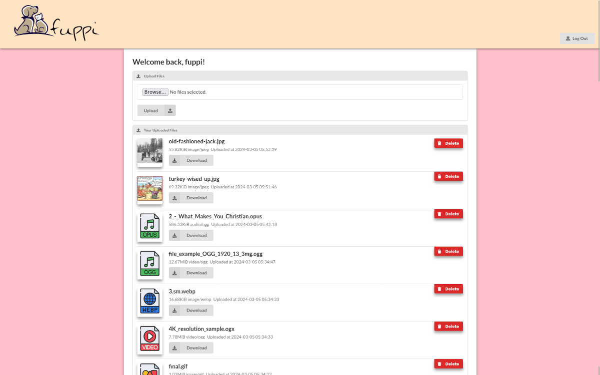

# 🚀 Phuppi 2.0

The PHP file-uppie thingy so you can share files and notes. Keep your data safe and accessible with top-notch security, passwords, vouchers and tokens. 



## ⚡ Quick Start – Up and Running in 2 Minutes

1️⃣ Grab the code: [from Github](https://github.com/AntzCode/phuppi/archive/refs/heads/main.zip)  
2️⃣ Unzip and upload to your server: [cPanel - how to upload files with FTP](https://docs.cpanel.net/knowledge-base/ftp/how-to-upload-files-with-ftp/)  
3️⃣ Open your website in your browser and set a username/password for the admin account  [(↗️ screenshot)](./assets/screenshots/installation.png)  

No tricky database configuration needed - it uses [SQLite](https://sqlite.org/)!

## 🎯 Share in Seconds

1. Login.
2. Upload files or write notes.
3. Generate a unique link to the download (choose an expiry if you want).
4. Share the link!

## 🔥 Why Phuppi Rocks

- **Seamless integration with S3** - makes connecting to cloud storage easy.
- **Zero-setup magic** – Database is automatically created using SQLite.
- **Fort Knox security** – bcrypt passwords, one-time vouchers, expiring tokens.
- **Dead simple** – Upload, share, done. No tutorials needed.
- **All-in-one party** – Files, notes, auth, storage – bundled!

## 📋 Features That Wow

- Multiple File Uploader  [(↗️ screenshot)](./assets/screenshots/multiple-file-uploader.png)
- User Management and Flexible Permissions [(↗️ screenshot)](./assets/screenshots/users.png)
- Instant-access vouchers to easily share your upload rights with friends [(↗️ screenshot)](./assets/screenshots/vouchers.png)
- Flexible storage connectors - local filesystem or S3 [(↗️ screenshot)](./assets/screenshots/storage-connectors.png)
- Data migration tool for migrating data between S3 buckets [(↗️ screenshot)](./assets/screenshots/storage-connector-migration.png)
- De-duplicator tool for cleanup [(↗️ screenshot)](./assets/screenshots/duplicates.png)
- Token-based sharing for files & notes [(↗️ screenshot)](./assets/screenshots/share-link.png) [(↗️ screenshot)](./assets/screenshots/shared-note.png)
- Local filesystem storage or S3-compatible API support [(↗️ screenshot)](./assets/screenshots/active-storage-connector.png)
- Docker-ready configuration for dev & prod

## 🏗️ Under the Hood

Phuppi is made to be easy for owners to upload and modify. It has a lean file structure and avoids bloated libraries and complicated build tools. You can make changes to the code using the most modern libraries and techniques, and your changes are reflected as soon as you refresh the page!

- **Framework:** [Flight micro-framework for PHP](https://docs.flightphp.com/en/v3/)
- **Database:** [SQLite](https://sqlite.org/) (configuration not required)
- **Storage:** Local files or [S3-Compatible](https://aws.amazon.com/s3/) Cloud Storage
- **Security:** bcrypt, sessions, tokens
- **Templating:** [Latte templates for PHP](https://latte.nette.org/en/)
- **Frontend:** [Preact standalone edition](https://preactjs.com/)

## ⚡ Run on Docker for local development (takes just 5 Minutes)

```bash
# 1️⃣ Grab the code
git clone https://github.com/AntzCode/phuppi.git
cd phuppi

# 2️⃣ customise the settings
cp .env.example .env
nano .env # or right-click and open with your IDE

# 3️⃣  Fire up Docker
docker compose up -d --build

# 4️⃣ Set it up
docker exec -it phuppi php src/bootstrap.php install

# 5️⃣ Boom! Open http://localhost
```

**Pro tip:** add minio to your hosts file if you want to use minio local S3 containers 🔐

`echo "127.0.0.1 minio" | sudo tee -a /etc/hosts`


## 📚 Documentation

To generate API documentation using phpDocumentor:

```bash
docker compose run --rm phpdoc phpdoc -d src -t docs
```

The generated documentation will be available in the `docs/` directory. Open `docs/index.html` in your browser to view it.

## 🤝 Contribute

Love it? Fork, tweak, PR! Check [`CONTRIBUTING.md`](CONTRIBUTING.md).

## 📄 License

GPLv3 – See [`LICENSE`](LICENSE). 

You are free to use, study, and modify this software. If you distribute the program or a derivative, you must provide the full source code and license the entire work under GPL‑v3 (or a later version), ensuring the same rights for downstream users.

---

*Ready to share securely? Let's go!* 🚀
