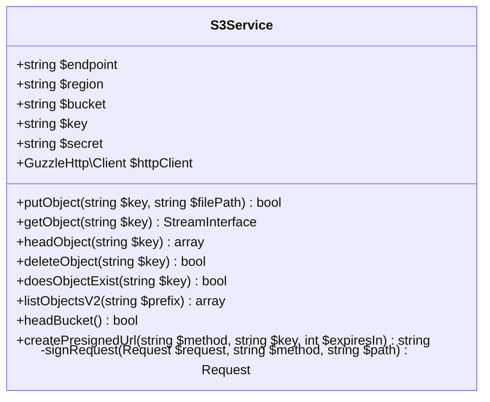

# AWS SDK Replacement Plan

## Overview

Replace the bulky AWS SDK (bundled in `src/aws/`) with a lean, custom S3-compatible service using Guzzle HTTP client. The project only uses a handful of S3 operations which can be achieved with simple REST API calls.

## Current State Analysis

### AWS SDK Usage

The AWS SDK is bundled directly in `src/aws/` (not a Composer dependency - appears to be a full copy). The following S3 operations are actively used:

| Operation | Usage Location | Purpose |
|-----------|----------------|---------|
| `putObject` | [`S3Storage::put()`](src/Phuppi/Storage/S3Storage.php:89) | Upload files to S3 |
| `getObject` | [`S3Storage::getStream()`](src/Phuppi/Storage/S3Storage.php:112), [`FileController`](src/Phuppi/Controllers/FileController.php:432) | Download/stream files |
| `headObject` | [`S3Storage::size()`](src/Phuppi/Storage/S3Storage.php:162), [`FileController`](src/Phuppi/Controllers/FileController.php:366) | Get file metadata (size, content-type) |
| `deleteObject` | [`S3Storage::delete()`](src/Phuppi/Storage/S3Storage.php:140) | Delete files |
| `doesObjectExist` | [`S3Storage::exists()`](src/Phuppi/Storage/S3Storage.php:128) | Check file existence |
| `listObjectsV2` | [`SettingsController`](src/Phuppi/Controllers/SettingsController.php:788) | List files (orphaned file scan) |
| `headBucket` | [`S3Storage::testConnection()`](src/Phuppi/Storage/S3Storage.php:227) | Test connection |
| `createPresignedRequest` | [`S3Storage::getUrl()`](src/Phuppi/Storage/S3Storage.php:180), [`getPresignedPutUrl()`](src/Phuppi/Storage/S3Storage.php:202) | Generate presigned URLs |

### Direct S3Client Usage in FileController

The [`FileController`](src/Phuppi/Controllers/FileController.php) uses the S3Client directly for:
- Streaming files with Range header support (HTTP 206 partial content)
- Video preview streaming

This needs to be abstracted into the custom service as well.

---

## Implementation Plan

### Phase 1: Create Custom S3 Service

Create `src/Phuppi/Storage/S3Service.php` - a lightweight S3-compatible REST client:

**Key Methods:**
- `putObject()` - PUT file to bucket
- `getObject()` - GET file with streaming support
- `headObject()` - HEAD request for metadata
- `deleteObject()` - DELETE object
- `doesObjectExist()` - HEAD request to check existence
- `listObjectsV2()` - GET bucket with prefix listing
- `headBucket()` - HEAD bucket to test connection
- `createPresignedUrl()` - Generate signed URL (AWS Signature V4)

### Phase 2: Update S3Storage Wrapper

Update [`S3Storage`](src/Phuppi/Storage/S3Storage.php) to use the new `S3Service` instead of `Aws\S3\S3Client`:

- Replace `S3Client` property with `S3Service`
- Update all method implementations to delegate to `S3Service`
- Maintain the same public interface for backward compatibility

### Phase 3: Handle Direct S3Client Usage

Refactor [`FileController`](src/Phuppi/Controllers/FileController.php) to not require direct S3Client access:

- Add methods to `S3Service` for Range request streaming
- Update `S3Storage` to expose these capabilities
- Remove direct `$storage->getS3Client()` calls

### Phase 4: Remove AWS SDK

- Delete entire `src/aws/` directory
- Remove any AWS-related imports and references

---

## Implementation Checklist

- [ ] Create `src/Phuppi/Storage/S3Service.php` with Guzzle HTTP client
- [ ] Implement AWS Signature V4 signing for authentication
- [ ] Implement all required S3 operations (put, get, head, delete, list)
- [ ] Implement presigned URL generation
- [ ] Add Range request support for streaming
- [ ] Update `S3Storage` to use `S3Service`
- [ ] Refactor `FileController` to remove direct S3Client usage
- [ ] Update `SettingsController` orphaned file scanning
- [ ] Delete `src/aws/` directory
- [ ] Test all storage operations
- [ ] Verify presigned URLs work
- [ ] Verify file streaming with Range headers works

---

## Benefits

1. **Reduced Installation Size** - Remove ~5,000 files from vendor
2. **Faster Installation** - No need to download/install massive AWS SDK
3. **Easier Maintenance** - Single custom service vs. massive SDK
4. **Better Performance** - Lightweight HTTP calls only
5. **Full S3 Compatibility** - Works with AWS S3, Digital Ocean Spaces, MinIO, etc.

---

## Dependencies

The new implementation will require:
- `guzzlehttp/guzzle` - HTTP client (already available in project)
- `guzzlehttp/psr7` - PSR-7 stream implementation (for file streaming)

No additional Composer dependencies required.
