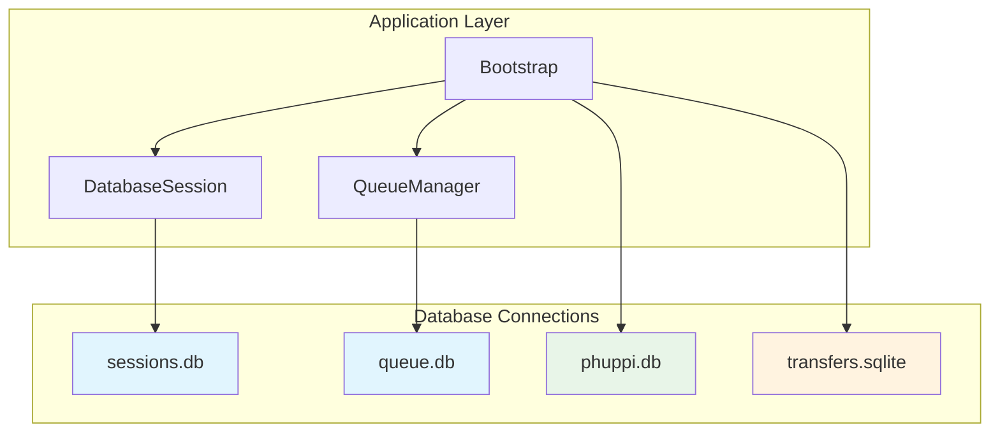

# Database Isolation Plan

## Overview

Refactor the application to use separate SQLite database files for sessions and queue jobs, providing better isolation, easier maintenance, and improved recovery options.

**Current State:**
- All application data stored in single SQLite database (`data/phuppi.db`)
- Sessions table created in `src/Phuppi/Migration.php` within main DB
- Queue tables (`preview_jobs`, `video_preview_jobs`, `queue_locks`, `delete_transfer_stats_jobs`) in main DB

**Target State:**
```
data/
├── phuppi.db      # Main application data (users, files, settings, etc.)
├── sessions.db    # User sessions only
├── queue.db       # Queue jobs only
└── transfers.sqlite  # Transfer stats (already separate)
```

---

## Architecture



---

## Implementation Steps

### Step 1: Update Bootstrap - Add New Database Registrations

**File:** `src/bootstrap.php`

Add new database registration functions for sessions and queue databases:

```php
// Add after register_transfer_stats_db()
function register_sessions_db() {
    $dataPath = Flight::get('flight.data.path');
    $sessionsDbPath = $dataPath . DIRECTORY_SEPARATOR . 'sessions.sqlite';
    
    Flight::register('sessionsDb', 'PDO', array('sqlite:' . $sessionsDbPath), function ($db) {
        $db->setAttribute(PDO::ATTR_ERRMODE, PDO::ERRMODE_EXCEPTION);
        $db->exec('PRAGMA journal_mode = WAL');
        $db->exec('PRAGMA busy_timeout = 5000');
        $db->exec('PRAGMA synchronous = FULL');
    });
}

function register_queue_db() {
    $dataPath = Flight::get('flight.data.path');
    $queueDbPath = $dataPath . DIRECTORY_SEPARATOR . 'queue.sqlite';
    
    Flight::register('queueDb', 'PDO', array('sqlite:' . $queueDbPath), function ($db) {
        $db->setAttribute(PDO::ATTR_ERRMODE, PDO::ERRMODE_EXCEPTION);
        $db->exec('PRAGMA journal_mode = WAL');
        $db->exec('PRAGMA busy_timeout = 5000');
        $db->exec('PRAGMA synchronous = FULL');
        $db->exec('PRAGMA cache_size = -10000');
        $db->exec('PRAGMA wal_autocheckpoint = 1000');
    });
}
```

**Actions:**
- [ ] Add `register_sessions_db()` function
- [ ] Add `register_queue_db()` function
- [ ] Call both functions after `register_transfer_stats_db()`
- [ ] Add integrity check for both new databases

---

### Step 2: Update DatabaseSession to Use Sessions DB

**File:** `src/Phuppi/DatabaseSession.php`

Modify the constructor to accept the sessions database connection:

- [ ] Update constructor to accept sessions DB PDO
- [ ] Update class docblock to document new database parameter
- [ ] Change `Flight::register('session', ...)` in bootstrap to use sessions DB

---

### Step 3: Update QueueManager to Use Queue DB

**File:** `src/Phuppi/Queue/QueueManager.php`

Update all database operations to use queue DB instead of main DB:

- [ ] Add `getQueueDb()` method or use `Flight::queueDb()`
- [ ] Update `createJob()` method to use queue DB for job creation
- [ ] Update `createVideoPreviewJob()` method
- [ ] Update `createDeleteTransferStatsJob()` method
- [ ] Update `claimNext()` method
- [ ] Update `claimNextVideoPreview()` method
- [ ] Update `claimNextDeleteTransferStatsJob()` method
- [ ] Update `cleanupExpiredLocks()` method
- [ ] Update `hasPendingJobs()` method
- [ ] Update `hasPendingVideoPreviewJobs()` method
- [ ] Update `getSetting()` method

---

### Step 4: Update Queue Job Classes

**Files:**
- `src/Phuppi/Queue/PreviewJob.php`
- `src/Phuppi/Queue/VideoPreviewJob.php`
- `src/Phuppi/Queue/DeleteTransferStatsJob.php`

- [ ] Update all PDO operations to use queue DB

---

### Step 5: Update Migration.php

**File:** `src/Phuppi/Migration.php`

- [ ] Remove sessions table creation from `init()` method (lines 38-47)
- [ ] Sessions will now be created in the separate sessions database

---

### Step 6: Update Migration Files for Queue Tables

**Files:**
- `src/migrations/004_add_preview_fields.php`
- `src/migrations/007_add_video_preview_jobs_table.php`
- `src/migrations/009_add_delete_transfer_stats_jobs_table.php`

**Strategy:** Create new migration files that connect to queue DB and create the necessary tables. The old migrations will fail gracefully if tables already exist in main DB.

**Actions:**
- [ ] Create `src/migrations/012_create_sessions_db_tables.php` - Initialize sessions DB with sessions table
- [ ] Create `src/migrations/013_create_queue_db_tables.php` - Initialize queue DB with all queue tables
- [ ] Document that migration should drop old tables from main DB on next major version

---

### Step 7: Update Docker Configuration

**File:** `docker-compose.yml`

The data directory is already mapped: `./data:/var/www/data`

**Actions:**
- [ ] Verify volume mapping is correct (already present)
- [ ] No changes required - new database files will be persisted automatically

---

### Step 8: Configuration Option for Custom Database Paths

**File:** `src/bootstrap.php`

Add environment variable support for custom database paths:

- [ ] Add support for `PHUPPI_SESSIONS_DB_PATH` environment variable
- [ ] Add support for `PHUPPI_QUEUE_DB_PATH` environment variable

---

## Testing Checklist

### Functional Testing
- [ ] Verify sessions persist correctly in `sessions.db`
- [ ] Verify queue jobs process correctly from `queue.db`
- [ ] Test user login/logout flow
- [ ] Test file upload triggers preview generation
- [ ] Test queue worker processes jobs

### Failure Scenario Testing
- [ ] Test corrupted session DB doesn't affect main app
- [ ] Test corrupted queue DB doesn't affect main app
- [ ] Test main DB corruption doesn't affect sessions/queue
- [ ] Verify graceful degradation when separate DBs are unavailable

### Data Reset Testing
- [ ] Test clearing sessions independently (without affecting main DB)
- [ ] Test clearing queue jobs independently (without affecting main DB)

### Docker Testing
- [ ] Verify volume persistence across container restarts
- [ ] Verify new database files are created on first use

---

## Risk Mitigation

| Risk | Mitigation |
|------|------------|
| Migration complexity | Start fresh - existing session/queue data cleared; test thoroughly in development |
| Connection overhead | Use persistent PDO connections with WAL mode |
| File management | Clear naming conventions (`sessions.sqlite`, `queue.sqlite`) |
| Backward compatibility | Existing `phuppi.db` remains unchanged |

---

## File Changes Summary

### Files to Modify
| File | Action | Purpose |
|------|--------|---------|
| `src/bootstrap.php` | Modify | Add sessions/queue DB registrations |
| `src/Phuppi/DatabaseSession.php` | Modify | Connect to sessions.db |
| `src/Phuppi/Queue/QueueManager.php` | Modify | Connect to queue.db |
| `src/Phuppi/Queue/PreviewJob.php` | Modify | Connect to queue.db |
| `src/Phuppi/Queue/VideoPreviewJob.php` | Modify | Connect to queue.db |
| `src/Phuppi/Queue/DeleteTransferStatsJob.php` | Modify | Connect to queue.db |
| `src/Phuppi/Migration.php` | Modify | Remove sessions table creation from main DB |

### Files to Create
| File | Action | Purpose |
|------|--------|---------|
| `src/migrations/012_create_sessions_db_tables.php` | Create | Initialize sessions DB schema |
| `src/migrations/013_create_queue_db_tables.php` | Create | Initialize queue DB schema |

### Files to Verify
| File | Action | Purpose |
|------|--------|---------|
| `docker-compose.yml` | Verify | Volume mapping already present |

---

## References

- Related: [`src/Phuppi/DatabaseSession.php`](src/Phuppi/DatabaseSession.php)
- Related: [`src/Phuppi/Queue/QueueManager.php`](src/Phuppi/Queue/QueueManager.php)
- Related: [`src/bootstrap.php`](src/bootstrap.php)
- Existing pattern: [`src/bootstrap.php`](src/bootstrap.php) - `register_transfer_stats_db()` function (already implements separate DB)
