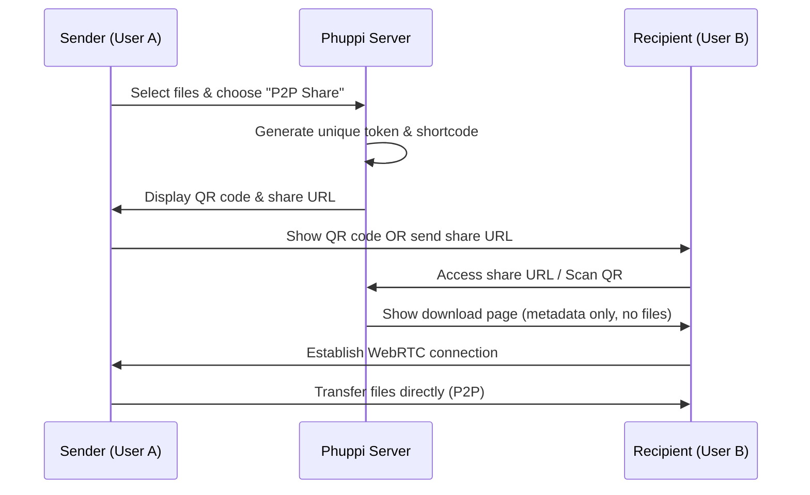

# P2P File Sharing via QR Code and Browser - Technical Plan

**Author:** Anthony Gallon  
**Owner/Licensor:** AntzCode Ltd <https://www.antzcode.com>  
**Contact:** https://github.com/AntzCode  
**Date:** 2026-03-21  
**Status:** Feasibility Confirmed - Implementation Ready

---

## 1. Executive Summary

This document outlines the technical plan for implementing a peer-to-peer (P2P) file sharing feature in Phuppi. The feature allows registered users to select files from their device and share them directly with another person via WebRTC, without uploading files to the Phuppi server. Sharing is accomplished through QR code scanning or URL sharing, with the transfer happening directly between browsers.

**Feasibility Assessment:** ✅ **CONFIRMED - IMPLEMENTABLE**

The feature is technically feasible using:
- WebRTC Data Channels for P2P file transfer
- QR codes for connection establishment (works excellently for local network/WiFi hotspot scenarios)
- Local network socket connections when on the same network

---

## 2. Feature Requirements

### 2.1 Core Functionality

| Requirement | Description |
|-------------|-------------|
| File Selection | Users can select multiple files from their device |
| P2P Transfer | Files transfer directly browser-to-browser via WebRTC |
| No Server Upload | Files never touch Phuppi servers |
| Token System | Unique token for batch share stored in database |
| Shortcode URL | Shareable URL generated for the batch |
| QR Code | Display QR code on sender's screen for easy scanning |
| Download Page | Recipient sees download page similar to existing batch share |
| Individual Download | Recipients can download files individually |
| Bulk Download | Recipients can download all files as ZIP |
| WiFi Hotspot Support | Works over WiFi hotspot without internet consumption |

### 2.2 User Flow



---

## 3. Technical Architecture

### 3.1 High-Level Design

```
┌─────────────────────────────────────────────────────────────────┐
│                        PHUPPI SERVER                            │
│  ┌─────────────┐  ┌─────────────┐  ┌─────────────────────────┐  │
│  │   Routes    │  │ Controllers │  │  p2p_shared_files Table │  │
│  │  /p2p/*     │  │ P2PController│ │  (token, metadata)     │  │
│  └─────────────┘  └─────────────┘  └─────────────────────────┘  │
│         │                │                     │                 │
└─────────┼────────────────┼─────────────────────┼─────────────────┘
          │                │                     │
          │         Creates metadata             │
          │         entry only                  │
          │                │                     │
          ▼                ▼                     ▼
┌─────────────────────────────────────────────────────────────────┐
│                     BROWSER (SENDER)                            │
│  ┌─────────────┐  ┌─────────────┐  ┌─────────────────────────┐  │
│  │ File API    │  │ QR Generator │  │  WebRTC/P2P Engine      │  │
│  │ (select)    │  │ (display)    │  │  (file transfer)       │  │
│  └─────────────┘  └─────────────┘  └─────────────────────────┘  │
└─────────────────────────────────────────────────────────────────┘
          │                                      │
          │      Direct P2P Connection          │
          │      (WiFi/LAN/WebRTC)              │
          ▼                                      ▼
┌─────────────────────────────────────────────────────────────────┐
│                   BROWSER (RECIPIENT)                           │
│  ┌─────────────┐  ┌─────────────┐  ┌─────────────────────────┐  │
│  │ QR Scanner  │  │ Download UI │  │  WebRTC/P2P Engine     │  │
│  │ (camera)    │  │ (batch view)│  │  (receive files)       │  │
│  └─────────────┘  └─────────────┘  └─────────────────────────┘  │
└─────────────────────────────────────────────────────────────────┘
```

### 3.2 Connection Methods (in priority order)

| Priority | Method | Use Case | Complexity |
|----------|--------|----------|------------|
| 1 | **WebRTC with STUN (Default)** | Same WiFi network - automatic discovery | Low |
| 2 | WebRTC with PeerJS | Different networks via cloud signaling | Medium |
| 3 | Local Network TCP | WiFi Hotspot fallback | Low |

**Default Behavior:** When both devices are connected to the same WiFi router, WebRTC with STUN servers will automatically discover local ICE candidates and establish a direct P2P connection. No user configuration required - it just works.

### 3.3 Signaling Architecture

#### Option A: WebRTC with STUN (Same WiFi - Default)
```
┌──────────────┐     STUN Server      ┌──────────────┐
│   Sender     │◄───────────────────►│   Receiver   │
│  Browser     │   (free public)      │   Browser    │
└──────────────┘                      └──────────────┘
        │                                     │
        │   Direct P2P (via local network)   │
        └─────────────────────────────────────┘
```
- Uses public STUN servers (e.g., `stun:stun.l.google.com:19302`)
- ICE candidates include local IP addresses
- Works automatically when on same WiFi
- No external signaling needed for same-network

#### Option B: PeerJS Cloud Signaling (Different Networks)
```
┌──────────────┐    PeerJS Cloud     ┌──────────────┐
│   Sender     │◄───────────────────►│   Receiver   │
│  Browser     │   (free signaling) │   Browser    │
└──────────────┘                      └──────────────┘
        │                                     │
        │        Direct P2P (WebRTC)          │
        └─────────────────────────────────────┘
```
- Uses PeerJS cloud for initial connection handshake
- After connection, data flows directly P2P
- MITM Protection: 2-digit PIN required (see Section 3.4)

### 3.4 MITM Protection: 2-Digit PIN

To prevent man-in-the-middle attacks when using PeerJS cloud signaling, a **2-digit PIN** is displayed on the sender's screen and must be entered by the recipient before transfer begins.

#### How It Works:

```
┌─────────────────────┐          ┌─────────────────────┐
│     SENDER          │          │    RECIPIENT        │
│                     │          │                     │
│  ┌───────────────┐  │          │  ┌───────────────┐  │
│  │ 🔒 PIN: 42    │  │          │  │ Enter PIN:    │  │
│  │               │  │          │  │ [ ] [ ]       │  │
│  │ ████████████   │  │          │  │    [Submit]   │  │
│  │ Scan this QR  │  │          │  └───────────────┘  │
│  └───────────────┘  │          │         │           │
│         │           │          │         ▼           │
│         │ QR Code   │          │   Validates PIN      │
│         │ contains  │          │   before transfer    │
│         │ token +   │          │                      │
│         │ peerjs id │          │                      │
└─────────┼───────────┘          └──────────────────────┘
          │
          ▼
    PeerJS Server
    (uses PIN to
     authenticate)
```

#### PIN Flow:
1. **Sender** generates a random 2-digit PIN (e.g., "42")
2. **PIN displayed** on sender's screen (large, readable font)
3. **QR code** contains PeerJS connection ID (not the PIN)
4. **Recipient** scans QR, opens download page
5. **Recipient** must enter the PIN shown on sender's screen
6. **Transfer only begins** after PIN validation
7. If PIN incorrect 3 times, connection is rejected

#### Why This Works:
- **PIN not in QR**: An attacker scanning the QR can't see the PIN (it's on screen)
- **Visual verification**: Sender and recipient are physically together, can confirm PIN
- **Simple for users**: Just read two digits from sender's screen
- **Effective protection**: MITM attacker would need to be present AND know the PIN

### 3.5 QR Code Data Structure

The QR code contains a JSON object with connection metadata:

```json
{
  "token": "p2p_abc123xyz",
  "type": "phuppi_p2p",
  "version": 1,
  "peerId": "peerjs-unique-id",
  "files": {
    "count": 3,
    "totalSize": 15728640,
    "names": ["photo.jpg", "document.pdf", "video.mp4"]
  }
}
```

**Note:** PIN is NOT in the QR code - it's displayed separately on sender's screen.

**QR Code Size:** Approximately 300-500 bytes (well within QR code limits)

---

## 4. Database Schema

### 4.1 New Table: `p2p_shared_files`

```sql
CREATE TABLE p2p_shared_files (
    id INTEGER PRIMARY KEY AUTOINCREMENT,
    user_id INTEGER NOT NULL,
    token VARCHAR(64) NOT NULL UNIQUE,
    shortcode VARCHAR(12) NOT NULL UNIQUE,
    peerjs_id VARCHAR(64) NULL,           -- PeerJS connection ID
    pin VARCHAR(2) NOT NULL,              -- 2-digit PIN for MITM protection
    pin_attempts TINYINT DEFAULT 0,      -- Failed PIN attempts
    pin_locked_at DATETIME NULL,          -- Lockout timestamp
    files_metadata TEXT NOT NULL,         -- JSON: [{name, size, type}, ...]
    created_at DATETIME NOT NULL,
    expires_at DATETIME NOT NULL,
    is_active BOOLEAN NOT NULL DEFAULT 1,
    FOREIGN KEY (user_id) REFERENCES users(id)
);

CREATE INDEX idx_p2p_token ON p2p_shared_files(token);
CREATE INDEX idx_p2p_shortcode ON p2p_shared_files(shortcode);
CREATE INDEX idx_p2p_peerjs_id ON p2p_shared_files(peerjs_id);
```

**PIN Security:**
- 2-digit numeric PIN (10-99)
- Max 3 attempts before lockout
- Lockout lasts 5 minutes
- PIN is displayed on sender's screen, NOT in QR code

### 4.2 Migration File

Create `012_add_p2p_shared_files_table.php` in `src/migrations/`

---

## 5. API Endpoints

### 5.1 Backend Routes

| Method | Endpoint | Description | Auth |
|--------|----------|-------------|------|
| POST | `/api/p2p/create` | Create P2P share session | Required |
| GET | `/api/p2p/@token` | Get share metadata | Public |
| GET | `/p2p/@shortcode` | Render download page | Public |
| DELETE | `/api/p2p/@token` | Cancel/expire share | Required (owner) |
| POST | `/api/p2p/@token/verify-pin` | Verify recipient's PIN | Public |
| POST | `/api/p2p/@token/connect` | Register PeerJS connection | Public |

### 5.2 WebRTC STUN Configuration

```javascript
const rtcConfig = {
  iceServers: [
    // Google STUN servers (free, public)
    { urls: 'stun:stun.l.google.com:19302' },
    { urls: 'stun:stun1.l.google.com:19302' },
    { urls: 'stun:stun2.l.google.com:19302' },
    // If needed, add TURN server here (for restricted networks)
  ],
  iceCandidatePoolSize: 10
};
```

**How STUN Works for Same WiFi:**
1. Both devices create ICE candidates
2. STUN server helps discover public IPs
3. **Important:** Local network ICE candidates are also gathered
4. WebRTC tries all candidates - local ones work best on same WiFi
5. Direct P2P connection established without internet (when on same LAN)

### 5.2 Frontend WebRTC Signaling

| Method | Direction | Description |
|--------|-----------|-------------|
| WebSocket | Bidirectional | Local network discovery |
| HTTP Polling | Recipient→Server | Fallback for connection status |

---

## 6. Implementation Components

### 6.1 Backend (PHP)

| Component | File | Description |
|-----------|------|-------------|
| P2PController | `src/Phuppi/Controllers/P2PController.php` | Main controller |
| P2PShareToken | `src/Phuppi/P2PShareToken.php` | Model for tokens |
| Migration | `src/migrations/012_add_p2p_shared_files_table.php` | Database schema |

### 6.2 Frontend (JavaScript/Preact)

| Component | Location | Description |
|-----------|----------|-------------|
| P2P Share UI | `src/views/p2p-share.latte` | Sender's share page |
| P2P Receive UI | `src/views/p2p-receive.latte` | Recipient's download page |
| P2P Engine | `public/assets/js/phuppi-p2p.js` | Core WebRTC/P2P logic |
| QR Generator | `public/assets/js/qrcode.min.js` | QR code generation |

### 6.3 Client-Side Libraries

| Library | Purpose | CDN/Source |
|---------|---------|------------|
| qrcode.js | QR code generation | Bundled |
| **peerjs** | WebRTC signaling & data channels | Bundled (CDN) |
| JSZip | ZIP file creation for bulk download | Bundled |
| FileSaver.js | Save downloaded files | Bundled |
| qrcode-scanner | Camera-based QR scanning | Bundled |

---

## 7. Implementation Steps

### Phase 1: Database & Backend Foundation

- [ ] **Step 1.1:** Create migration `012_add_p2p_shared_files_table.php`
- [ ] **Step 1.2:** Create `P2PShareToken` model class
- [ ] **Step 1.3:** Create `P2PController` with CRUD operations
- [ ] **Step 1.4:** Add routes for P2P endpoints in `routes.php`
- [ ] **Step 1.5:** Implement shortcode generation utility

### Phase 2: Sender Interface

- [ ] **Step 2.1:** Add "P2P Share" button to file list UI
- [ ] **Step 2.2:** Create file selection interface
- [ ] **Step 2.3:** Implement token creation API call
- [ ] **Step 2.4:** Create `p2p-share.latte` template
- [ ] **Step 2.5:** Implement QR code generation
- [ ] **Step 2.6:** Display shareable URL with copy button

### Phase 3: Recipient Interface

- [ ] **Step 3.1:** Create `p2p-receive.latte` template
- [ ] **Step 3.2:** Implement file list display (from metadata)
- [ ] **Step 3.3:** Add individual file download buttons
- [ ] **Step 3.4:** Add bulk ZIP download option
- [ ] **Step 3.5:** Implement QR code scanner (camera access)

### Phase 4: P2P Transfer Engine

- [ ] **Step 4.1:** Create `phuppi-p2p.js` core module
- [ ] **Step 4.2:** Implement local network TCP server (sender)
- [ ] **Step 4.3:** Implement local network client (recipient)
- [ ] **Step 4.4:** Add WebRTC DataChannel fallback
- [ ] **Step 4.5:** Implement file chunking for large files
- [ ] **Step 4.6:** Add progress tracking UI
- [ ] **Step 4.7:** Implement transfer verification (checksum)

### Phase 5: Polish & Testing

- [ ] **Step 5.1:** Add transfer progress indicators
- [ ] **Step 5.2:** Handle connection failures gracefully
- [ ] **Step 5.3:** Add expiration cleanup job
- [ ] **Step 5.4:** Cross-browser testing (Chrome, Firefox, Safari)
- [ ] **Step 5.5:** Mobile device testing
- [ ] **Step 5.6:** WiFi hotspot scenario testing

---

## 8. UI/UX Design

### 8.1 Sender's Screen (After Selecting Files)

```
┌─────────────────────────────────────────────────────┐
│  🏠 Home  /  📁 Files                              │
├─────────────────────────────────────────────────────┤
│                                                     │
│   📱 P2P File Share                                │
│   ─────────────────────────────                    │
│                                                     │
│   Files to share (3):                               │
│   ├─ 📷 vacation_photo.jpg    4.2 MB               │
│   ├─ 📄 report_2024.pdf       1.8 MB               │
│   └─ 🎬 presentation.mp4     45 MB                 │
│                                                     │
│   Total: 51 MB                                      │
│                                                     │
│   ─────────────────────────────────────────────     │
│                                                     │
│   🔐 Security PIN (tell recipient):                 │
│   ┌─────────────────────────────────────────┐      │
│   │                 42                        │      │
│   │         (Enter this on their device)    │      │
│   └─────────────────────────────────────────┘      │
│                                                     │
│   📌 Share Options:                                 │
│                                                     │
│   ┌─────────────────────────────────────────────┐   │
│   │                                             │   │
│   │         ████████████████                    │   │
│   │         ████████████████                    │   │
│   │         ██       ██████                    │   │
│   │         ██       ██████                    │   │
│   │         ████████████████                    │   │
│   │         ████████████████                    │   │
│   │                                             │   │
│   │   Scan to receive files                     │   │
│   └─────────────────────────────────────────────┘   │
│                                                     │
│   Or share link:                                    │
│   ┌─────────────────────────────────────────┐      │
│   │ https://phuppi.com/p2p/abc123        📋 │      │
│   └─────────────────────────────────────────┘      │
│                                                     │
│   ⏱️ Expires in: 24 hours                           │
│   📡 Connection: Ready (WebRTC)                     │
│                                                     │
└─────────────────────────────────────────────────────┘
```

### 8.2 Recipient's Screen - Before PIN Entry

```
┌─────────────────────────────────────────────────────┐
│  📥 P2P File Transfer                              │
├─────────────────────────────────────────────────────┤
│                                                     │
│   🔐 Enter Security PIN                             │
│   ─────────────────────────────────────────────     │
│                                                     │
│   Ask the sender for their PIN code                 │
│                                                     │
│   ┌─────────────────────────────────────────┐      │
│   │  [ ] [ ]                                │      │
│   │     Enter 2-digit PIN                    │      │
│   └─────────────────────────────────────────┘      │
│                                                     │
│   Sender: John's iPhone                             │
│   Files: 3 (51 MB)                                  │
│                                                     │
│   ┌─────────────────────────────────────────────┐   │
│   │         ████████████████                    │   │
│   │   or Scan QR from sender's screen          │   │
│   └─────────────────────────────────────────────┘   │
│                                                     │
└─────────────────────────────────────────────────────┘
```

### 8.3 Recipient's Screen - After PIN Verified (Download Page)

```
┌─────────────────────────────────────────────────────┐
│  📥 P2P File Transfer                              │
├─────────────────────────────────────────────────────┤
│   ✅ PIN Verified                                   │
│   ─────────────────────────────────────────────     │
│                                                     │
│   Sender: John's iPhone                             │
│   Files available: 3                                │
│   Total size: 51 MB                                 │
│   Connection: P2P Established (via WiFi)            │
│                                                     │
│   ─────────────────────────────────────────────     │
│                                                     │
│   📁 vacation_photo.jpg        4.2 MB    📥        │
│   📄 report_2024.pdf           1.8 MB    📥        │
│   🎬 presentation.mp4        45 MB     📥        │
│                                                     │
│   ─────────────────────────────────────────────     │
│                                                     │
│   ┌─────────────────────────────────────────────┐   │
│   │  Downloading...  ████████░░░░  67%          │   │
│   │  presentation.mp4                         │   │
│   └─────────────────────────────────────────────┘   │
│                                                     │
│   📦 Download All as ZIP                           │
│                                                     │
└─────────────────────────────────────────────────────┘
```

---

## 9. Security Considerations

| Concern | Mitigation |
|---------|------------|
| Token guessing | Use cryptographically secure random tokens (64 chars) |
| Unauthorized access | Tokens expire after configurable time (default 24h) |
| **Man-in-middle (MITM)** | **2-digit PIN required - shown on sender's screen, entered by recipient** |
| MITM via signaling server | PIN not transmitted via PeerJS - verified server-side |
| PIN brute force | Max 3 attempts, 5-minute lockout after failures |
| Large file DoS | Implement chunked transfer with memory limits |
| File type abuse | Validate file metadata, scan on recipient device |
| WebRTC leaks | Use `RTCPeerConnection` with `iceServers` limited to STUN |

### 9.1 MITM Protection Details

**Threat Model:**
When using PeerJS cloud signaling, an attacker could potentially intercept the connection handshake and inject themselves between the two devices.

**Protection Mechanism:**
1. **PIN is NOT in QR code**: The 2-digit PIN is displayed on sender's screen only
2. **PIN verified server-side**: When recipient enters PIN, it's validated against the database
3. **PIN required before transfer**: WebRTC data channel only opens after PIN verification
4. **Lockout after failures**: 3 wrong PIN attempts = 5 minute lockout

**Attack Scenario Blocked:**
```
Attacker scans QR -> Gets peerjs_id -> Connects to PeerJS
    │                                                     
    │ But cannot see PIN (displayed on sender's screen)   
    ▼                                                     
Recipient enters PIN -> Server validates -> Transfer begins
    │                                                     
    │ Attacker cannot complete handshake without PIN     
    ▼                                                     
Transfer blocked! ✅
```

---

## 10. Performance Characteristics

| Metric | Target |
|--------|--------|
| QR code generation | < 100ms |
| Token creation API | < 200ms |
| Download page render | < 500ms |
| P2P connection establishment | < 3s (local network) |
| Transfer speed | Limited by WiFi speed (typical 20-100 MB/s) |
| Max file size | Limited by device memory (recommended < 500MB per file) |

---

## 11. Browser Compatibility

| Browser | Minimum Version | Notes |
|---------|-----------------|-------|
| Chrome | 80+ | Full support |
| Firefox | 75+ | Full support |
| Safari | 14+ | Full support |
| Edge | 80+ | Full support |
| Mobile Chrome | 80+ | Full support |
| Mobile Safari | 14+ | Requires HTTPS |

**Note:** Requires HTTPS for camera access (QR scanning) and WebRTC.

---

## 12. Offline & Network Capability

The P2P transfer works in various network scenarios:

| Scenario | Internet Required? | Connection Type | Speed |
|----------|-------------------|-----------------|-------|
| Same WiFi router | **No** | WebRTC with local ICE | 20-100 MB/s |
| WiFi Hotspot | **No** | Direct TCP/WebRTC | 20-50 MB/s |
| Different networks | Yes (minimal) | PeerJS cloud signaling | Limited by bandwidth |
| Airplane mode (same device) | **No** | Not supported | N/A |

**Connection Priority (Automatic):**
1. **Same WiFi**: WebRTC uses local ICE candidates - fastest, no internet
2. **WiFi Hotspot**: Direct connection via host's IP - no internet needed
3. **Different networks**: Falls back to PeerJS cloud signaling - minimal internet

**User Experience:**
- Users simply scan QR or open link - no network configuration needed
- System automatically finds best connection method
- PIN entry required for security (works even offline for same-network)

**For WiFi Hotspot scenario:**
1. Sender enables personal hotspot
2. Recipient connects to sender's hotspot
3. Transfer happens at hotspot speeds (typically 20-50 MB/s)
4. No mobile data consumed

---

## 13. Alternative Approaches Considered

### 13.1 WebRTC with Signaling Server

**Pros:** Works across different networks  
**Cons:** Requires building/maintaining signaling infrastructure  

### 13.2 Bluetooth (Web Bluetooth API)

**Pros:** No WiFi needed  
**Cons:** Limited range, browser support poor, slow transfer  

### 13.3 External P2P Service (e.g., PeerJS Cloud)

**Pros:** Simplest implementation  
**Cons:** External dependency, privacy concerns  

**Selected Approach:** Local network + QR codes provides best balance of simplicity, privacy, and reliability for the primary use case.

---

## 14. Future Enhancements (Post-MVP)

| Enhancement | Description |
|-------------|-------------|
| Multiple recipients | Allow multiple devices to connect simultaneously |
| Transfer resume | Resume interrupted transfers |
| Compression | Optional LZ4 compression for faster transfer |
| Folder support | Share entire folders as ZIP |
| AirDrop-like mode | Auto-discover nearby devices via Bluetooth |

---

## 15. Risk Assessment

| Risk | Likelihood | Impact | Mitigation |
|------|------------|--------|------------|
| Local network firewall blocking | Medium | High | Provide manual IP entry fallback |
| WebRTC connection failure | Low | Medium | Retry with STUN server |
| Large file memory issues | Low | Medium | Implement streaming chunk transfer |
| Browser compatibility issues | Low | Medium | Progressive enhancement, graceful degradation |
| QR code scanning failure | Low | Low | Provide manual URL entry option |

---

## 16. Conclusion

This P2P file sharing feature is **technically feasible and well-scoped** for implementation. The enhanced approach using WebRTC with STUN provides the best user experience - it works automatically when both devices are on the same WiFi network, with no configuration required.

### Key Enhancements from Original Plan:

1. **WebRTC with STUN as Default**: When devices are on the same WiFi, WebRTC automatically discovers local ICE candidates and establishes direct P2P connection. This is the most convenient option - no hotspot setup needed.

2. **PeerJS Cloud Signaling**: For devices on different networks, PeerJS provides free cloud signaling. This is a fallback, not the primary method.

3. **PIN-Based MITM Protection**: A 2-digit PIN displayed on sender's screen (not in QR) prevents man-in-middle attacks. This is:
   - Simple for users (just read 2 digits)
   - Effective against MITM (PIN verified server-side)
   - Not in the QR code (attacker can't see it)

### Value Proposition:

| Benefit | Description |
|---------|-------------|
| **Zero Setup** | Same WiFi = works automatically |
| **No Internet Required** | Transfer over local network |
| **Privacy** | Files never touch Phuppi servers |
| **Fast** | Limited only by WiFi speed |
| **Secure** | PIN-based MITM protection |
| **Convenient** | QR code + URL sharing options |

**Recommendation:** Proceed with implementation using the phased approach outlined above.
