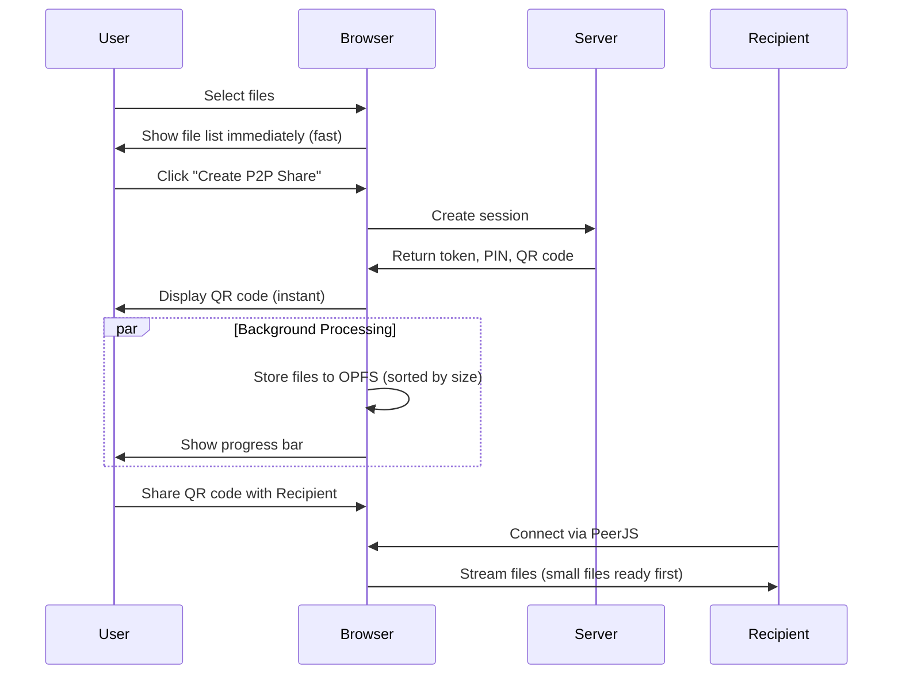

# P2P Lazy Storage Optimization Plan

## Problem

When selecting a large number of files or large files, the "Choose Files" button is slow because:
1. Files are written to OPFS immediately on selection (blocking operation)
2. Each file is processed sequentially, not in parallel
3. User sees no feedback while waiting

## Solution

Move OPFS storage to happen AFTER the QR code is generated - during the idle time while recipient scans QR and enters PIN. This uses the wait time productively.

## Architecture



## Implementation Steps

### 1. Remove OPFS Storage from File Selection

**File**: `src/views/p2p-sender.latte`

Remove the `OPFSManager.storeFiles(files)` call from the `fileInput` change handler (lines 905-916). Files should only be kept in memory.

```javascript
// OLD - remove this
const stored = await OPFSManager.storeFiles(files);
if (stored) {
    selectedFiles = files;
    console.log('Files stored in OPFS for persistence');
} else {
    selectedFiles = files;
    console.log('Files not stored in OPFS (using in-memory only)');
}

// NEW - just use the File objects directly
selectedFiles = files;
```

### 2. Add Progress Bar UI

**File**: `src/views/p2p-sender.latte`

Add progress bar element to the file selection section:

```html
<div id="storage-progress" class="ui progress" style="display: none;">
    <div class="bar" style="width: 0%">
        <div class="progress-text">Preparing files...</div>
    </div>
    <div class="label">Storing files for transfer</div>
</div>
```

### 3. Create BackgroundStorageManager

**File**: `src/views/p2p-sender.latte`

Create a new manager object to handle background storage:

```javascript
const BackgroundStorageManager = {
    // Track storage status per file
    fileStatus: {}, // { fileId: 'pending' | 'storing' | 'ready' | 'error' }
    
    // Store all files in background after QR generated
    storeAllFiles: async function(files, onProgress) {
        // Sort files by size (smallest first) for faster streaming
        const sortedFiles = [...files].sort((a, b) => a.size - b.size);
        
        // Process in parallel batches of 3
        const BATCH_SIZE = 3;
        const totalFiles = sortedFiles.length;
        let completedFiles = 0;
        
        for (let i = 0; i < sortedFiles.length; i += BATCH_SIZE) {
            const batch = sortedFiles.slice(i, i + BATCH_SIZE);
            
            await Promise.all(batch.map(async (file) => {
                const fileId = btoa(file.name + ':' + file.size + ':' + file.lastModified);
                this.fileStatus[fileId] = 'storing';
                
                await P2PChunkStorage.storeFileInOPFS(fileId, file);
                await P2PChunkStorage.saveSenderFileMetadata({
                    fileId: fileId,
                    name: file.name,
                    size: file.size,
                    type: file.type || 'application/octet-stream',
                    lastModified: file.lastModified
                });
                
                this.fileStatus[fileId] = 'ready';
                completedFiles++;
                
                // Callback for UI update
                if (onProgress) {
                    onProgress({
                        file: file.name,
                        completed: completedFiles,
                        total: totalFiles,
                        percent: Math.round((completedFiles / totalFiles) * 100)
                    });
                }
            }));
        }
        
        return true;
    },
    
    // Check if a specific file is ready
    isFileReady: function(fileId) {
        return this.fileStatus[fileId] === 'ready';
    },
    
    // Reset status
    reset: function() {
        this.fileStatus = {};
    }
};
```

### 4. Modify Create Share Handler

**File**: `src/views/p2p-sender.latte`

Update the `createShareBtn` click handler to:
1. Generate QR code immediately (instant)
2. Then start background storage with progress

```javascript
createShareBtn.addEventListener('click', async () => {
    if (selectedFiles.length === 0) return;
    
    // ... existing code to create session ...
    
    // After getting response, show QR code immediately
    SessionManager.showShareSection({...});
    SessionManager.initializePeerJS(sessions[0]);
    
    // THEN start background storage
    const progressDiv = document.getElementById('storage-progress');
    progressDiv.style.display = 'block';
    
    // Store files in background
    await BackgroundStorageManager.storeAllFiles(selectedFiles, (progress) => {
        // Update progress bar
        const bar = progressDiv.querySelector('.bar');
        bar.style.width = progress.percent + '%';
        progressDiv.querySelector('.progress-text').textContent = 
            `Storing files... ${progress.completed}/${progress.total}`;
        
        // Update individual file status in UI
        updateFileStorageStatus(progress.file, 'ready');
    });
    
    progressDiv.querySelector('.label').textContent = 'Files ready for transfer!';
});
```

### 5. Update File List UI with Status

**File**: `src/views/p2p-sender.latte`

Modify `renderSelectedFiles()` to show storage status per file:

```javascript
function updateFileStorageStatus(fileName, status) {
    const items = selectedFilesList.querySelectorAll('.item');
    items.forEach(item => {
        if (item.querySelector('.header').textContent === fileName) {
            const statusIcon = item.querySelector('.status-icon');
            if (status === 'ready') {
                statusIcon.innerHTML = '<i class="check green circle icon"></i>';
            } else if (status === 'storing') {
                statusIcon.innerHTML = '<i class="loading spinner icon"></i>';
            }
        }
    });
}
```

### 6. Handle Transfer Before Storage Complete

During file transfer, check both OPFS and original File object:

```javascript
// In sendFiles function
let fileToRead = file;
if (BackgroundStorageManager.isFileReady(fileId)) {
    // Use OPFS for better performance
    fileToRead = await P2PChunkStorage.getOPFSFileAsFile(fileId);
} else {
    // Fallback to original File object if not yet stored
    fileToRead = file;
}
```

## Files to Modify

| File | Changes |
|------|---------|
| `src/views/p2p-sender.latte` | Main implementation - remove eager storage, add background storage |

## No Changes Needed

| File | Reason |
|------|--------|
| `public/assets/p2p-chunk-storage.js` | Already has all needed functions |
| Server-side code | No backend changes required |

## Benefits

1. **Instant file selection** - UI responds immediately when choosing files
2. **Uses idle time** - QR code display period utilized for file storage
3. **Progressive readiness** - Small files available first for streaming
4. **User feedback** - Progress bar shows storage status
5. **No blocking** - UI remains responsive during background storage
