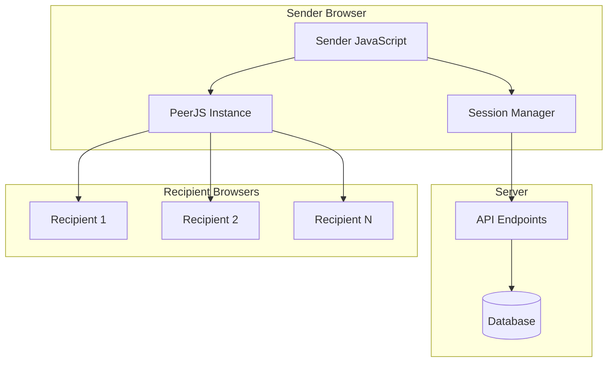

# P2P Session Management Implementation Plan

## Problem Statement

Current issues:
1. When sender refreshes the page, all session state is lost
2. No UI to view or manage existing P2P sessions
3. No support for multiple recipients per session
4. No way to resume a session after page refresh

## Architecture Overview



## Data Model Changes

### New Table: `p2p_connections`

```sql
CREATE TABLE p2p_connections (
    id INTEGER PRIMARY KEY AUTOINCREMENT,
    p2p_token_id INTEGER NOT NULL,
    recipient_peerjs_id VARCHAR(64),
    recipient_ip VARCHAR(45),
    status VARCHAR(20) DEFAULT 'connected',
    connected_at DATETIME DEFAULT CURRENT_TIMESTAMP,
    disconnected_at DATETIME,
    FOREIGN KEY (p2p_token_id) REFERENCES p2p_shared_files(id)
);
```

### Modified: P2PShareToken

Add method to find all active sessions for a user:
- `findActiveByUserId(int $userId): array` - Get all active (not expired) sessions

### New: P2PConnection Model

```php
class P2PConnection {
    public $id;
    public $p2p_token_id;
    public $recipient_peerjs_id;
    public $recipient_ip;
    public $status; // 'connected', 'disconnected', 'completed'
    public $connected_at;
    public $disconnected_at;
}
```

## API Endpoints

### New Endpoints

| Method | Endpoint | Description | Auth |
|--------|----------|-------------|------|
| GET | `/api/p2p` | List all active P2P sessions for current user | Required |
| GET | `/api/p2p/@token/connections` | Get all connections for a session | Required (owner) |
| POST | `/api/p2p/@token/connections` | Register a new connection | Public |
| DELETE | `/api/p2p/@token/connections/@id` | Mark connection as disconnected | Public |

### Modified Endpoints

| Method | Endpoint | Change |
|--------|----------|--------|
| GET | `/p2p` | Show session list + create new session form |

## UI Changes

### 1. Main P2P Page (`/p2p`)

```
┌─────────────────────────────────────────────────────────────┐
│ P2P File Share                                    [+ New] │
├─────────────────────────────────────────────────────────────┤
│ Active Sessions                                              │
├─────────────────────────────────────────────────────────────┤
│ ┌─────────────────────────────────────────────────────────┐ │
│ │ 📄 files.zip (2 files, 15MB)                            │ │
│ │    PIN: 42 | Shortcode: ABC123XYZ                      │ │
│ │    Created: 10 mins ago | Expires: 23 hours            │ │
│ │    Status: ● Connected (1 recipient)                   │ │
│ │    [View QR] [Copy Link] [Cancel]                       │ │
│ └─────────────────────────────────────────────────────────┘ │
│                                                              │
│ ┌─────────────────────────────────────────────────────────┐ │
│ │ 📄 documents.zip (5 files, 45MB)                       │ │
│ │    PIN: 87 | Shortcode: DEF456UVW                      │ │
│ │    Created: 2 hours ago | Expires: 21 hours            │ │
│ │    Status: ○ No recipients yet                          │ │
│ │    [View QR] [Copy Link] [Cancel]                       │ │
│ └─────────────────────────────────────────────────────────┘ │
└─────────────────────────────────────────────────────────────┘
```

### 2. Session Detail View (after clicking "View QR")

```
┌─────────────────────────────────────────────────────────────┐
│ ← Back to Sessions         Session: files.zip              │
├─────────────────────────────────────────────────────────────┤
│                                                              │
│  ┌──────────────┐    ┌────────────────────────────────────┐│
│  │              │    │  Security PIN: 42                 ││
│  │              │    │                                    ││
│  │     QR       │    │  Share Link:                       ││
│  │    Code      │    │  https://.../p2p/ABC123XYZ        ││
│  │              │    │  [Copy]                             ││
│  └──────────────┘    └────────────────────────────────────┘│
│                                                              │
│  Connected Recipients                                       │
│  ┌────────────────────────────────────────────────────────┐ │
│  │ ● Recipient 1 - Connected 5 mins ago                  │ │
│  │ ● Recipient 2 - Connected 2 mins ago                 │ │
│  └────────────────────────────────────────────────────────┘ │
│                                                              │
│  Files Shared (2 files, 15MB)                               │
│  - document.pdf (10MB)                                      │
│  - image.png (5MB)                                          │
│                                                              │
│  [Send More Files] [Cancel Session]                         │
└─────────────────────────────────────────────────────────────┘
```

### 3. Session Card (Component)

Properties:
- File names (truncated if needed)
- File count and total size
- PIN (for display)
- Shortcode
- Created time
- Expiration time
- Connection status badge
- Action buttons: View QR, Copy Link, Cancel

## JavaScript Changes

### Sender Page

```javascript
// Session Manager Module
const SessionManager = {
    sessions: [],
    currentSession: null,
    peerConnections: {}, // peerId -> connection
    
    // Load all sessions from API
    async loadSessions() {
        const response = await fetch('/api/p2p');
        this.sessions = await response.json();
        this.renderSessionList();
    },
    
    // Select a session and show details
    selectSession(token) {
        this.currentSession = this.sessions.find(s => s.token === token);
        this.initializePeerForSession(this.currentSession);
    },
    
    // Initialize PeerJS for a specific session
    initializePeerForSession(session) {
        // Clean up existing peer if any
        if (this.peer) {
            this.peer.destroy();
        }
        
        this.peer = new Peer(session.shortcode + '-' + session.token.substring(0, 8), {
            debug: 2
        });
        
        this.peer.on('connection', (conn) => this.handleNewConnection(conn, session));
        this.peer.on('error', (err) => this.handlePeerError(err));
    },
    
    // Handle incoming connection from recipient
    handleNewConnection(conn, session) {
        const connectionId = conn.peer;
        
        // Register with server
        this.registerConnection(session.token, connectionId);
        
        conn.on('open', () => {
            this.peerConnections[connectionId] = conn;
            this.updateConnectionStatus(session.token, connectionId, 'connected');
            this.renderConnections();
        });
        
        conn.on('close', () => {
            this.peerConnections[connectionId] = null;
            this.updateConnectionStatus(session.token, connectionId, 'disconnected');
            this.renderConnections();
        });
        
        conn.on('data', (data) => this.handleData(data, conn));
    },
    
    // Register connection with server
    async registerConnection(token, peerId) {
        await fetch(`/api/p2p/${token}/connections`, {
            method: 'POST',
            headers: { 'Content-Type': 'application/json' },
            body: JSON.stringify({ recipient_peerjs_id: peerId })
        });
    },
    
    // Handle data from recipient
    handleData(data, conn) {
        if (data.type === 'request-files') {
            this.sendFiles(conn, this.currentSession.files);
        }
    },
    
    // Send files to a specific connection
    async sendFiles(conn, files) {
        // ... file sending logic
    }
};
```

### Key Changes from Current Implementation

1. **Named PeerJS IDs**: Use `{shortcode}-{token_prefix}` format for peer IDs to maintain session identity across page refreshes
2. **Multiple Connection Tracking**: Store all active connections in `peerConnections` object
3. **Connection Registration**: Register each connection with server for tracking
4. **Session Persistence**: Load sessions from API on page load
5. **PeerJS Cleanup**: Properly destroy peer instances when switching sessions

## Implementation Steps

### Phase 1: Backend Changes

1. **Create Migration**
   - Add `p2p_connections` table
   - Add indexes for performance

2. **Create P2PConnection Model**
   - CRUD operations
   - Find by token
   - Find active connections

3. **Add API Endpoints**
   - `GET /api/p2p` - List user's sessions
   - `GET /api/p2p/@token/connections` - List connections
   - `POST /api/p2p/@token/connections` - Register connection
   - `DELETE /api/p2p/@token/connections/@id` - Disconnect

### Phase 2: UI Changes

4. **Update Main P2P Page**
   - Add session list view
   - Add "New Session" button (existing create flow)
   - Add session cards with status

5. **Add Session Detail View**
   - QR code display
   - PIN and link display
   - Connected recipients list

### Phase 3: JavaScript Changes

6. **Update Sender JavaScript**
   - Session Manager module
   - Named PeerJS IDs
   - Multiple connection handling
   - Connection state tracking

7. **Update Recipient JavaScript**
   - Support for named peer IDs
   - Auto-reconnect on sender refresh

## Compatibility Notes

- Existing sessions created before this change will still work
- The `peerjs_id` in `p2p_shared_files` can be deprecated in favor of connection tracking
- Shortcode-based PeerJS IDs ensure backward compatibility with existing share links

## Testing Checklist

- [ ] Create new P2P session and verify it appears in list
- [ ] Refresh page and verify sessions are restored
- [ ] Connect multiple recipients to same session
- [ ] Verify all recipients receive files
- [ ] Disconnect and reconnect a recipient
- [ ] Cancel a session and verify it's removed from list
- [ ] Test expiration handling
- [ ] Test PIN verification still works
- [ ] Test QR code scanning still works
