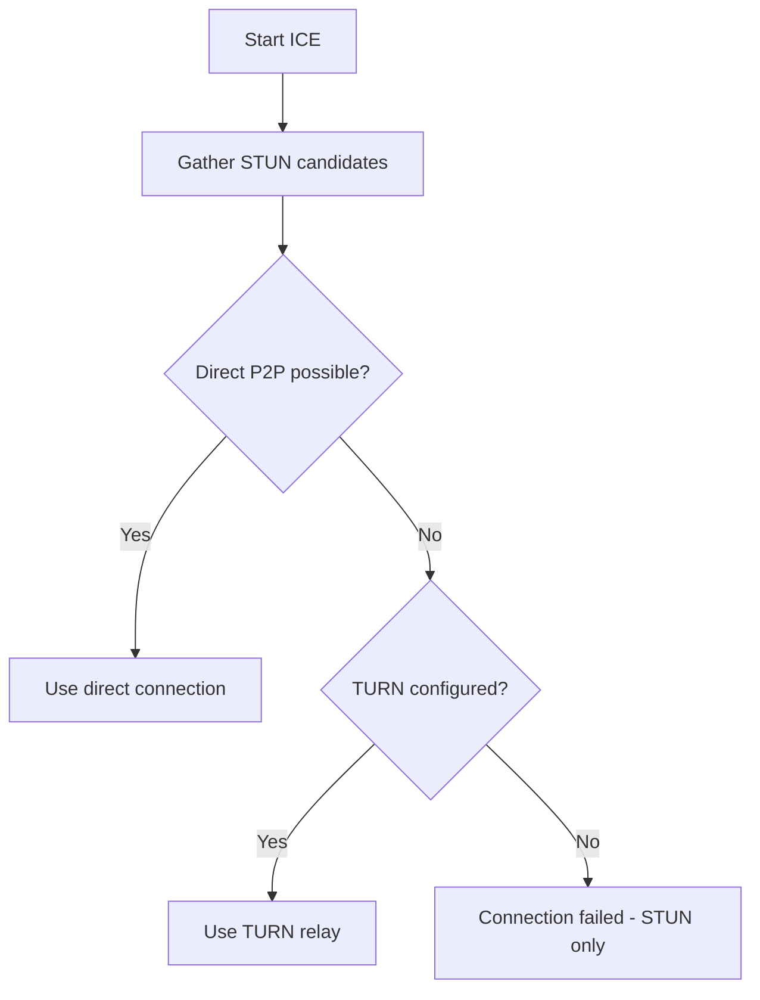

# TURN Server Support for P2P File Sharing

## Summary

Add TURN server configuration support to Phuppi's P2P file sharing feature to enable reliable connections in restricted network environments where direct peer-to-peer connectivity is not possible.

## Background

Phuppi's P2P file sharing feature currently uses STUN servers only for ICE candidate discovery. While STUN works well for devices on the same network or with accessible IP addresses, it fails in several common scenarios:

- **Symmetric NAT** - Both peers behind different NAT types
- **Corporate firewalls** - UDP blocked by corporate network policies
- **Carrier-Grade NAT (CGNAT)** - Common on mobile networks
- **Restrictive firewalls** - Only allow HTTP/HTTPS outbound

Users in these scenarios cannot establish P2P connections and see errors like "peer unavailable" or "connection failed".

## Feature Requirements

### Core Functionality

| Requirement | Description |
|-------------|-------------|
| TURN Server Config in Admin UI | Site owner configures TURN in Settings area |
| Environment Variable Fallback | Optional config via PHUPPI_TURN_* env vars |
| Fallback Behavior | Use TURN relay when direct P2P fails |
| Secure Credentials | TURN credentials stored in database, not exposed |
| Transport Options | Support UDP, TCP, and TLS transports |
| Graceful Degradation | STUN-only mode if no TURN configured |

### Configuration

| Config Option | Type | Admin UI Key | Env Variable | Description |
|---------------|------|--------------|--------------|-------------|
| TURN URL | string | `p2p_turn_url` | `PHUPPI_TURN_URL` | TURN server URL (e.g., `turn:turn.example.com:3478`) |
| TURN Username | string | `p2p_turn_username` | `PHUPPI_TURN_USERNAME` | Username for TURN authentication |
| TURN Credential | string | `p2p_turn_credential` | `PHUPPI_TURN_CREDENTIAL` | Password for TURN authentication |
| Transport | string | `p2p_turn_transport` | `PHUPPI_TURN_TRANSPORT` | Transport: `udp` (default), `tcp`, or `tls` |

### Configuration Priority

1. **Admin UI Settings** (primary) - configured in Settings page
2. **Environment Variables** (fallback) - for Docker/non-database deployments
3. **STUN only** (default) - gracefully allow failure if neither configured

### User Flow

1. **Admin configures** TURN server in Settings UI (or uses env vars)
2. **Sender** creates P2P share session
3. **ICE negotiation** attempts direct connection via STUN
4. **If STUN fails**, TURN relay is used automatically (if configured)
5. **If no TURN configured**, connection fails gracefully (existing behavior)

## Technical Details

### Admin UI Location

Add section to existing Settings page at `/settings`:

```
Settings / P2P File Sharing (TURN Server)
├── TURN Server URL: [________________________]
├── TURN Username: [________________________]
├── TURN Credential: [________________________]
├── Transport: (o) UDP ( ) TCP ( ) TLS
└── Save Settings
```

### Storage

Settings stored in `app_settings` table:
- Key: `p2p_turn_url` | Value: `turn:server.com:3478`
- Key: `p2p_turn_username` | Value: `user`
- Key: `p2p_turn_credential` | Value: `password`
- Key: `p2p_turn_transport` | Value: `udp`

### ICE Server Priority



### Current Implementation (STUN only)

Located in [`src/views/p2p-sender.latte:466-475`](src/views/p2p-sender.latte:466):

```javascript
const iceServers = [
    { urls: 'stun:stun.l.google.com:19302' },
    { urls: 'stun:stun1.l.google.com:19302' },
    // ... more STUN servers
];
```

### Required Changes

| File | Change |
|------|--------|
| `src/views/settings.latte` | Add TURN configuration form |
| `src/Phuppi/Controllers/SettingsController.php` | Handle TURN settings save |
| `src/views/p2p-sender.latte` | Add TURN servers to ICE config |
| `src/views/p2p-receive.latte` | Add TURN servers to ICE config |
| `.env.example` | Add TURN env vars |

## Implementation

### Phase 1: Admin UI

- [ ] Add TURN fields to settings form in `settings.latte`
- [ ] Update SettingsController to handle TURN settings
- [ ] Add validation for TURN URL format

### Phase 2: Backend

- [ ] Load TURN settings from database with env fallback
- [ ] Pass TURN config to P2P templates

### Phase 3: Frontend

- [ ] Modify ICE server config in `p2p-sender.latte`
- [ ] Modify ICE server config in `p2p-receive.latte`

### Phase 4: Testing

- [ ] Test with TURN server
- [ ] Test STUN-only fallback
- [ ] Test env variable override

## Dependencies

| Library | Purpose | Status |
|---------|---------|--------|
| PeerJS | WebRTC abstraction | Already bundled |
| STUN Servers | Already configured | Already working |
| TURN Server | Relay (external) | Needs configuration |

## Benefits

| Benefit | Description |
|---------|-------------|
| **Wider Compatibility** | Works behind corporate firewalls and CGNAT |
| **Reliability** | TURN fallback ensures connection |
| **Admin Control** | Site owner configures in familiar Settings UI |
| **No Breaking Changes** | STUN-only by default, opt-in TURN |
| **Privacy Preserved** | TURN only relays, doesn't store files |

## Risks

| Risk | Likelihood | Mitigation |
|------|------------|------------|
| TURN server unavailable | Low | Document provider options |
| Credential exposure | Medium | Database + HTTPS, server-side only |
| Performance impact | Medium | Use TURN only when needed |

## Alternative Approaches Considered

### 1. Self-Hostored TURN (Coturn)
- Pros: Full control, unlimited usage
- Cons: Requires server infrastructure

### 2. Third-Party TURN Service
- Pros: Easy setup (Twilio, Metered.ca)
- Cons: Cost at scale, dependency on external service

### 3. SOCKS5 Proxy
- Pros: Simpler than TURN
- Cons: Less standard for WebRTC

**Recommended:** Option 2 (third-party) for initial implementation, with documentation for self-hosting option.

## Future Enhancements

- TURN server test button (verify credentials)
- Multiple TURN server support for redundancy
- TURN usage statistics in dashboard
- Auto-detect connection failure and auto-switch to TURN