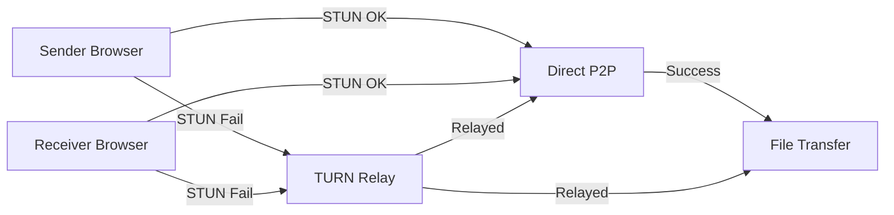

# TURN Server Support - Technical Plan

**Author:** Anthony Gallon  
**Owner/Licensor:** AntzCode Ltd https://www.antzcode.com  
**Contact:** https://github.com/AntzCode  
**Date:** 2026-03-23  
**Status:** In Planning

---

## 1. Executive Summary

This document outlines the technical plan for adding TURN server support to Phuppi's P2P file sharing feature. Currently, the application uses STUN servers only, which work well when devices are on the same network or have direct peer-to-peer connectivity. However, in certain network scenarios (symmetric NAT, corporate firewalls, mobile carrier-grade NAT), STUN alone is insufficient and TURN servers are required to relay traffic.

The TURN server configuration will be available in the Admin UI Settings area, with environment variables as a fallback option. If no TURN server is configured, only STUN servers will be used (existing behavior), allowing connections to fail gracefully in restricted network environments.

---

## 2. Problem Statement

### 2.1 Current Implementation

The current P2P implementation in [`p2p-sender.latte:466-475`](src/views/p2p-sender.latte:466) uses only STUN servers:

```javascript
const iceServers = [
    { urls: 'stun:stun.l.google.com:19302' },
    { urls: 'stun:stun1.l.google.com:19302' },
    { urls: 'stun:stun2.l.google.com:19302' },
    { urls: 'stun:stun3.l.google.com:19302' },
    { urls: 'stun:stun4.l.google.com:19302' },
    { urls: 'stun:stun.stunprotocol.org:3478' }
];
```

### 2.2 Limitation

STUN servers cannot establish connections when:
- Both peers are behind symmetric NAT
- Corporate firewalls block UDP
- Mobile devices on CGNAT (Carrier-Grade NAT)
- Firewalls with strict outbound rules

### 2.3 User Impact

Users experiencing these network conditions see:
- "Connection failed" errors
- "Peer unavailable" messages
- Inability to complete P2P transfers

---

## 3. Solution Overview

Add TURN server configuration support to enable P2P transfers in restricted network environments. TURN servers act as relays when direct P2P connection is not possible.

### 3.1 Architecture



### 3.2 Configuration Priority

1. **Admin UI Settings** (primary) - Site owner configures TURN server in Settings area
2. **Environment Variables** (fallback) - For Docker/static deployments without admin access
3. **STUN only** (default) - If neither configured, use only STUN and allow failure

---

## 4. Technical Requirements

### 4.1 Configuration Options

| Option | Type | Required | Description |
|--------|------|----------|-------------|
| `p2p_turn_url` | string | No | TURN server URL (e.g., `turn:turn.example.com:3478`) |
| `p2p_turn_username` | string | No | Username for TURN authentication |
| `p2p_turn_credential` | string | No | Password/credential for TURN authentication |
| `p2p_turn_transport` | string | No | Transport type: `udp`, `tcp`, or `tls` |

### 4.2 Admin UI Integration

Add P2P settings section to existing Settings page:

```
Settings / P2P File Sharing
├── TURN Server URL: [________________________]
├── TURN Username: [________________________]
├── TURN Credential: [________________________]
├── Transport: ( ) UDP ( ) TCP ( ) TLS
└── [Save Settings]
```

Fields stored in `app_settings` table with keys:
- `p2p_turn_url`
- `p2p_turn_username`  
- `p2p_turn_credential`
- `p2p_turn_transport`

### 4.3 Environment Variable Fallback

Check env vars if settings not configured in database:

```php
// Priority: Settings > Environment > Default (STUN only)
$turnUrl = $settings->get('p2p_turn_url') ?? getenv('PHUPPI_TURN_URL');
$turnUsername = $settings->get('p2p_turn_username') ?? getenv('PHUPPI_TURN_USERNAME');
$turnCredential = $settings->get('p2p_turn_credential') ?? getenv('PHUPPI_TURN_CREDENTIAL');
$turnTransport = $settings->get('p2p_turn_transport') ?? getenv('PHUPPI_TURN_TRANSPORT') ?? 'udp';
```

### 4.4 ICE Server Configuration Structure

```javascript
{
    urls: 'turn:turn.example.com:3478',
    username: 'user',
    credential: 'password',
    transport: 'udp' // optional, for forced transport
}
```

### 4.5 Fallback Behavior

```
┌─────────────────────────────────────────────┐
│         ICE Candidate Gathering            │
├─────────────────────────────────────────────┤
│ 1. Gather STUN candidates (free, no auth)  │
│ 2. Attempt direct P2P connection           │
│ 3. If fails, use TURN relay (if configured)│
│ 4. If no TURN, connection fails gracefully │
└─────────────────────────────────────────────┘
```

---

## 5. Implementation Components

### 5.1 Backend (PHP)

| Component | Description |
|-----------|-------------|
| Settings update | Modify SettingsController to save TURN config |
| Config loader | Load TURN settings from DB with env fallback |
| API endpoint | Pass TURN config to frontend via template |

### 5.2 Frontend (JavaScript)

| Component | File | Description |
|-----------|------|-------------|
| ICE Config | `p2p-sender.latte` | Dynamic TURN inclusion |
| ICE Config | `p2p-receive.latte` | Dynamic TURN inclusion |
| Admin Form | `settings.latte` | TURN configuration UI |

---

## 6. Security Considerations

### 6.1 Credential Management

| Concern | Mitigation |
|---------|------------|
| TURN credentials in UI | Stored in database, transmitted over HTTPS |
| Credential exposure | Only passed to frontend when configured |
| Credential theft | Use short-lived credentials, rotate periodically |
| Open relay abuse | Validate TURN server restricts by username/IP |

### 6.2 Recommended TURN Providers

| Provider | Free Tier | Notes |
|----------|-----------|-------|
| Twilio | 500GB/month | Requires signup, production-ready |
| Metered.ca | 5GB/month | Free tier available |
| Coturn (self-hosted) | Unlimited | Requires server, full control |
| Open Relay Project | Limited | Community, may be unreliable |

---

## 7. Implementation Steps

### Phase 1: Admin UI

- [ ] Add TURN configuration fields to settings form in `settings.latte`
- [ ] Update SettingsController to save TURN settings to `app_settings`
- [ ] Add validation for TURN URL format

### Phase 2: Backend Integration

- [ ] Add config loader method to retrieve TURN settings (DB + env fallback)
- [ ] Pass TURN config to P2P templates via template variables
- [ ] Update `.env.example` with TURN environment variables

### Phase 3: Frontend Integration

- [ ] Modify PeerJS initialization in `p2p-sender.latte` to include TURN if configured
- [ ] Modify PeerJS initialization in `p2p-receive.latte` to include TURN if configured
- [ ] Add graceful failure handling when TURN not available

### Phase 4: Testing

- [ ] Test with TURN server (requires external deployment)
- [ ] Test fallback behavior (STUN only)
- [ ] Test env variable fallback
- [ ] Verify credential security

---

## 8. Related Files

### Files to Modify

| File | Changes |
|------|---------|
| `src/views/settings.latte` | Add TURN config form fields |
| `src/Phuppi/Controllers/SettingsController.php` | Save TURN settings |
| `src/views/p2p-sender.latte` | Add TURN to iceServers |
| `src/views/p2p-receive.latte` | Add TURN to iceServers |
| `.env.example` | Add TURN env vars |

### Database Changes

| Table | Change |
|-------|--------|
| `app_settings` | New rows for TURN config keys |

---

## 9. Future Enhancements

| Enhancement | Description |
|-------------|-------------|
| TURN server test button | Verify TURN credentials are valid |
| Multiple TURN servers | Support redundancy with multiple relay servers |
| TURN usage stats | Track relay bandwidth usage |
| Auto TURN fallback | Detect connection failure and auto-switch to TURN |

---

## 10. Risk Assessment

| Risk | Likelihood | Impact | Mitigation |
|------|------------|--------|------------|
| TURN server unavailable | Low | High | Multiple providers documented |
| Credential leakage | Medium | High | Server-side validation, HTTPS only |
| Performance impact | Medium | Medium | Use TURN only when STUN fails |
| Configuration complexity | Medium | Low | Clear UI, defaults to STUN-only |

---

## 11. Conclusion

Adding TURN server support will significantly improve P2P connectivity success rates for users behind restrictive firewalls and NAT configurations. The implementation is straightforward:

1. Admin UI for TURN configuration (primary)
2. Environment variable fallback
3. STUN-only mode (default) - graceful degradation

No changes required for existing deployments - TURN is opt-in.