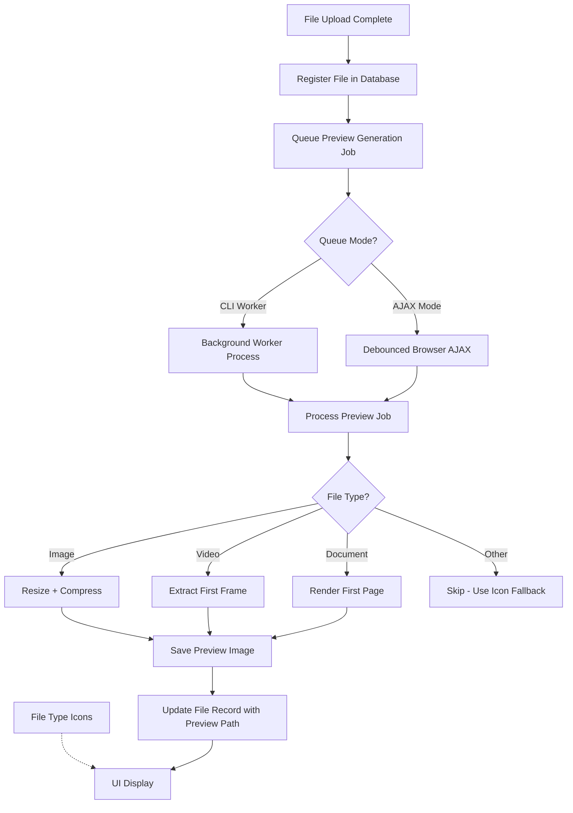

# Preview Image Generation Plan

**Version**: 1.0.0
**Author**: Anthony Gallon, AntzCode Ltd
**License**: GPLv3
**Last Updated**: 2025-02-25

## Overview

This document outlines the implementation plan for generating preview images for uploaded files in the Phuppi application. Preview images will be dedicated thumbnails for each file, with file type icons serving as a fallback when previews are unavailable.

## Requirements Summary

1. **Image Files**: Copy, resize, and compress the original image
2. **Video Files**: Extract a frame from the start of the video
3. **Documents**: Render the first page (PDF, DOCX, etc.)
4. **Queue Processing**: All preview generation should be deferred to a background queue
5. **Fallback**: File type icons should only be used when preview generation fails
6. **Shared Hosting Support**: AJAX-based queue processing as alternative to CLI worker

## Queue Processing Options

The system supports two queue processing modes, configurable via system settings:

### Option 1: CLI Worker (Recommended for VPS/Dedicated Servers)

A long-running PHP CLI script that polls the queue table and processes jobs continuously.

**Pros**: Efficient, handles high volume, no user impact
**Cons**: Requires CLI access and process management

### Option 2: AJAX-based Processing (For Shared Hosting)

Uses debounced AJAX calls from the browser to trigger queue processing. When users browse the file list, pending preview jobs are processed in the background.

**Pros**: Works on shared hosting without CLI access
**Cons**: Only processes when users are active, slightly higher latency

## Architecture



## Queue Processing Details

### CLI Worker Mode

The CLI worker is a simple PHP script that runs continuously:

```php
// bin/queue-worker.php
while (true) {
    $job = $queue->claimNext();
    if ($job) {
        $generator = new PreviewGenerator();
        $generator->process($job->uploaded_file_id);
        $job->markComplete();
    }
    sleep(5); // Poll every 5 seconds
}
```

**Startup**: `php bin/queue-worker.php`
**Process Manager**: Use systemd, supervisord, or pm2 to keep running

### AJAX-based Queue Mode

For shared hosting environments, the queue is processed via AJAX calls triggered by user activity:

1. **Frontend Trigger**: When a user loads the file list page, JavaScript checks for pending jobs
2. **Debounced Requests**: AJAX calls are debounced (300ms) to prevent flooding
3. **Batch Processing**: Each AJAX call processes up to 5 pending jobs
4. **Progress Indication**: Show preview generation progress in the UI

**API Endpoint**: `POST /api/queue/process`

```javascript
// Frontend implementation (pseudo-code)
function processQueue() {
    if (isProcessing) return;
    isProcessing = true;
    
    fetch('/api/queue/process', {
        method: 'POST',
        body: JSON.stringify({ limit: 5 })
    }).then(response => {
        updatePreviews(response.previews);
        if (response.hasMore) {
            setTimeout(processQueue, 1000); // Continue after delay
        }
    }).finally(() => {
        isProcessing = false;
    });
}

// Debounced trigger on page load
let queueTimer;
document.addEventListener('DOMContentLoaded', () => {
    clearTimeout(queueTimer);
    queueTimer = setTimeout(processQueue, 500);
});
```

### Job Locking Mechanism

To prevent queue overload and handle failed jobs, the system implements distributed locking:

**Database Lock Table**:
```sql
CREATE TABLE IF NOT EXISTS queue_locks (
    id INTEGER PRIMARY KEY AUTOINCREMENT,
    job_id INTEGER NOT NULL,
    lock_token VARCHAR(64) NOT NULL,
    locked_at DATETIME DEFAULT CURRENT_TIMESTAMP,
    expires_at DATETIME NOT NULL,
    FOREIGN KEY (job_id) REFERENCES preview_jobs (id)
);
```

**Lock Acquisition Process**:
1. Worker attempts to claim a pending job
2. Generates unique lock token (UUID)
3. Inserts lock record with 5-minute expiry
4. If lock acquired successfully, processes job
5. If lock fails (job already locked), skips to next job

**Lock Expiry Handling**:
- Locks automatically expire after 5 minutes
- Cron job or next worker run cleans up expired locks
- Expired jobs are marked as `failed` with error message
- Failed jobs are not retried automatically (manual intervention required)

**Benefits**:
- Prevents multiple workers from processing same job
- Protects against server overload from stuck jobs
- Failed jobs don't block the entire queue
- Simple cleanup mechanism for stale locks

**Cleanup Query** (run periodically):
```sql
UPDATE preview_jobs
SET status = 'failed', last_error = 'Lock expired - job timed out'
WHERE status = 'processing'
AND id IN (
    SELECT job_id FROM queue_locks
    WHERE expires_at < datetime('now')
);
DELETE FROM queue_locks WHERE expires_at < datetime('now');
```

### System Settings

Add settings to control preview generation and queue mode:

**Queue Settings**:
| Setting Name | Type | Default | Description |
|--------------|------|---------|-------------|
| preview_queue_mode | string | 'cli' | Queue processing mode: 'cli' or 'ajax' |
| preview_max_concurrent | int | 5 | AJAX mode: max jobs per request |
| preview_debounce_ms | int | 300 | AJAX mode: debounce delay |

**Preview Image Settings**:
| Setting Name | Type | Default | Description |
|--------------|------|---------|-------------|
| preview_width | int | 300 | Preview image width in pixels |
| preview_height | int | 300 | Preview image height in pixels |
| preview_format | string | 'jpeg' | Output format: 'jpeg', 'webp' |
| preview_quality | int | 80 | Image quality (1-100 for JPEG/WebP) |
| preview_max_size | int | 50 | Max file size in KB |

**Admin Actions**:
| Setting Name | Type | Description |
|--------------|------|-------------|
| preview_regenerate_all | string | Set to '1' to trigger regeneration of all previews |
| preview_clear_all | string | Set to '1' to delete all previews and requeue |

### Admin Management Interface

Add admin settings page section for preview management:

```php
// Admin routes for preview management
Flight::route('POST /admin/settings/preview/regenerate', [SettingsController::class, 'regenerateAllPreviews']);
Flight::route('POST /admin/settings/preview/clear', [SettingsController::class, 'clearAllPreviews']);
```

**Regenerate All Previews**:
1. Update all `preview_status` to 'pending'
2. Clear `preview_filename` field
3. Create new preview jobs for all files
4. Reset `preview_regenerate_all` setting to empty

**Clear All Previews**:
1. Delete all preview files from storage
2. Update all `preview_status` to 'pending'
3. Clear `preview_filename` and `preview_generated_at` fields
4. Create new preview jobs for all files
5. Reset `preview_clear_all` setting to empty
6. Clear expired queue locks

## Implementation Steps

### Step 1: Database Schema Updates

Add preview-related fields to the `uploaded_files` table:

```sql
ALTER TABLE uploaded_files ADD COLUMN preview_filename VARCHAR(255) NULL;
ALTER TABLE uploaded_files ADD COLUMN preview_status VARCHAR(20) DEFAULT 'pending';
ALTER TABLE uploaded_files ADD COLUMN preview_generated_at DATETIME NULL;
```

**Status values**: `pending`, `processing`, `completed`, `failed`

### Step 2: Create Preview Queue Table

```sql
CREATE TABLE IF NOT EXISTS preview_jobs (
    id INTEGER PRIMARY KEY AUTOINCREMENT,
    uploaded_file_id INTEGER NOT NULL,
    status VARCHAR(20) DEFAULT 'pending',
    attempts INTEGER DEFAULT 0,
    last_error TEXT NULL,
    created_at DATETIME DEFAULT CURRENT_TIMESTAMP,
    processed_at DATETIME NULL,
    FOREIGN KEY (uploaded_file_id) REFERENCES uploaded_files (id)
);
```

### Step 2b: Create Queue Locks Table

```sql
CREATE TABLE IF NOT EXISTS queue_locks (
    id INTEGER PRIMARY KEY AUTOINCREMENT,
    job_id INTEGER NOT NULL,
    lock_token VARCHAR(64) NOT NULL,
    locked_at DATETIME DEFAULT CURRENT_TIMESTAMP,
    expires_at DATETIME NOT NULL,
    FOREIGN KEY (job_id) REFERENCES preview_jobs (id)
);
```

### Step 3: Create Preview Generation Service

Create `src/Phuppi/Service/PreviewGenerator.php`:

- **ImageProcessor**: Handle image resizing and compression using GD/Imagick
- **VideoProcessor**: Extract frames using FFmpeg
- **DocumentProcessor**: Render first page using appropriate libraries
- **PreviewStorage**: Store generated previews in the same storage backend

### Step 4: Create Queue System

Create `src/Phuppi/Queue/QueueManager.php`:

- **Database-backed queue**: Simple table-based job queue
- **Worker script**: CLI script to process jobs
- **Job types**: `generate_preview`, `retry_preview`

### Step 5: Update File Registration

Modify `FileController::registerUploadedFile()` and `FileController::uploadFile()` to:

1. Create a preview job entry after file registration
2. Return preview status in API responses

### Step 6: Create Preview Endpoint

Add new route `GET /files/preview/@id` that:

1. Checks if preview exists
2. Returns preview image if available
3. Falls back to file type icon if not

### Step 7: Update Dockerfile

Install required dependencies:

```dockerfile
# For video processing
RUN apt-get update && apt-get install -y ffmpeg

# For document processing
RUN apt-get install -y libmagickwand-dev && docker-php-ext-install imagick

# For PDF processing
RUN apt-get install -y poppler-utils
```

### Step 8: Update Frontend

Modify file list templates to:

1. Display preview image when available
2. Fall back to file type icon when not
3. Show preview generation status

## File Type Support Matrix

| File Type | Preview Method | Libraries/Tools |
|-----------|---------------|-----------------|
| jpg, jpeg, png, gif, webp | Resize + Compress | GD/Imagick |
| mp4, avi, mkv, mov | Extract first frame | FFmpeg |
| pdf | Render first page | Imagick/Poppler |
| docx, doc | Render first page | LibreOffice |
| txt, md, csv | Generate text preview | Plain text |
| Other | Use icon fallback | N/A |

## Preview Image Specifications

Preview image specifications are configurable via system settings:

- **Dimensions**: Configurable (default 300x300 pixels, square crop)
- **Format**: Configurable (default JPEG)
- **Quality**: Configurable (default 80%)
- **Max file size**: Configurable (default 50KB)
- **Storage path**: `{user_id}/previews/{file_id}.{ext}`

The actual values are read from the settings table at generation time.

## Queue Worker Implementation

```php
// CLI script: worker.php
while (true) {
    $job = $queue->claimNext();
    if ($job) {
        $generator = new PreviewGenerator();
        $generator->process($job->uploaded_file_id);
        $job->markComplete();
    }
    sleep(5); // Poll every 5 seconds
}
```

## Error Handling

- **Transient failures**: Retry up to 3 times with exponential backoff
- **Permanent failures**: Mark as `failed`, log error, use icon fallback
- **Corrupted files**: Detect during processing, mark as failed

## Security Considerations

- Validate file types before processing
- Sanitize generated filenames
- Use secure temporary file handling
- Limit preview generation to allowed mime types

## Testing Strategy

1. Unit tests for each processor (image, video, document)
2. Integration tests for queue system
3. Manual testing with various file types
4. Performance testing with large files

## Rollout Plan

1. Deploy database migrations
2. Deploy new PHP classes
3. Update Dockerfile and rebuild container
4. Start queue worker
5. Backfill existing files (optional, via CLI command)

## Files to Create/Modify

### New Files
- `src/Phuppi/Service/PreviewGenerator.php`
- `src/Phuppi/Service/ImageProcessor.php`
- `src/Phuppi/Service/VideoProcessor.php`
- `src/Phuppi/Service/DocumentProcessor.php`
- `src/Phuppi/Queue/QueueManager.php`
- `src/Phuppi/Queue/PreviewJob.php`
- `bin/queue-worker.php`
- `bin/regenerate-previews.php`

### Modified Files
- `src/migrations/004_add_preview_fields.php` (new migration)
- `src/Phuppi/Controllers/FileController.php`
- `src/Phuppi/Controllers/QueueController.php` (new)
- `src/Phuppi/UploadedFile.php`
- `src/routes.php`
- `docker/php/Dockerfile`
- `src/views/filelist.latte` (add AJAX queue trigger)

## Estimated Effort

This is a medium-complexity feature requiring:
- Database changes: 1 migration
- Backend services: 6-8 new PHP classes
- Queue system: 2-3 files
- CLI tools: 2 scripts
- Dockerfile updates: minimal
- Frontend updates: template changes only

## Next Steps

1. Review and approve this plan
2. Switch to Code mode for implementation
3. Begin with database migration
4. Implement core preview generator service
5. Add queue system
6. Update file controller and routes
7. Update Dockerfile
8. Test with sample files

## Changelog

| Version | Date | Description |
|---------|------|-------------|
| 1.0.0 | 2025-02-25 | Initial plan document |
| 1.1.0 | 2026-02-28 | Feature fully implemented ✅ |
| | | - All planned components created and integrated |
| | | - Database migrations applied |
| | | - PreviewGenerator service with processors |
| | | - Queue system with CLI worker and AJAX fallback |
| | | - Admin settings and management endpoints |
| | | - UI updates for preview display |
| | | - Ready for production |