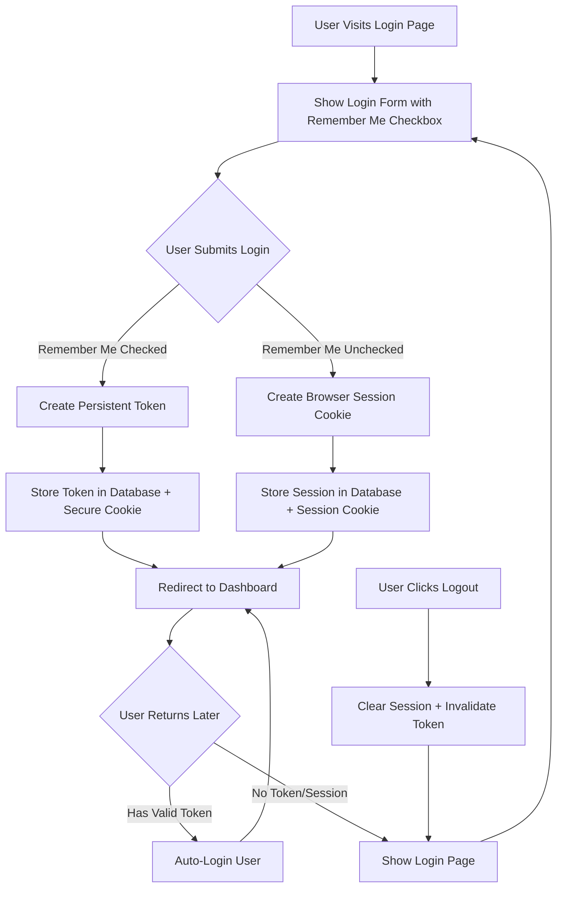
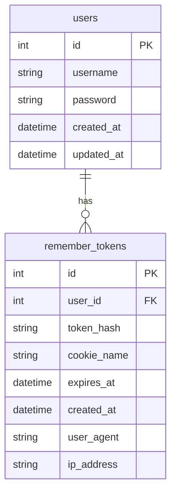

# Remember Me Feature Implementation Plan

**Author:** Anthony Gallon, Owner/Licensor: AntzCode Ltd <https://www.antzcode.com>, Contact: https://github.com/AntzCode  
**Date:** 2026-03-01  
**Status:** Planning

## Overview

This document outlines the implementation plan for adding a "Remember Me" checkbox to the Phuppi login page. The feature will allow users to stay authenticated across browser sessions when selected, using secure persistent authentication tokens.

## Requirements

1. Add "Remember Me" checkbox to login form
2. When enabled: maintain persistent login using long-lived authentication tokens (e.g., 30 days)
3. When disabled: session expires when browser is closed (browser session cookie)
4. Proper token handling and cleanup on logout
5. Follow security best practices for session management

## Architecture

### Authentication Flow Diagram

### Token Storage Schema

## Implementation Steps

### Step 1: Database Migration

Create a new migration to add the `remember_tokens` table for storing persistent authentication tokens.

**File:** `src/migrations/005_add_remember_tokens.php`

**Table Structure:**
- `id` - Primary key
- `user_id` - Foreign key to users table
- `token_hash` - Hashed token for security
- `cookie_name` - Identifier for the cookie
- `expires_at` - Token expiration datetime
- `created_at` - Creation datetime
- `user_agent` - Browser user agent for validation
- `ip_address` - IP address for validation

### Step 2: Create RememberToken Model

Create a new model class to handle remember token operations.

**File:** `src/Phuppi/RememberToken.php`

**Methods:**
- `create(int $userId): self` - Create new remember token
- `validate(string $token): ?self` - Validate and return token
- `delete(): bool` - Delete the token
- `deleteAllForUser(int $userId): void` - Invalidate all tokens for user
- `cleanupExpired(): int` - Remove expired tokens
- `isExpired(): bool` - Check if token is expired

### Step 3: Update Login View

Add "Remember Me" checkbox to the login form.

**File:** `src/views/login.latte`

**Changes:**
- Add checkbox input after password field
- Add styling for the checkbox
- Pass `rememberMe` parameter from controller

### Step 4: Update UserController

Modify login handling to support remember me functionality.

**File:** `src/Phuppi/Controllers/UserController.php`

**Changes:**
- `handleUserLogin()` - Process remember_me checkbox
- Create remember token when checkbox is checked
- Set appropriate cookie based on remember me selection
- Add `handleAutoLogin()` method for cookie-based authentication

### Step 5: Update Bootstrap

Modify session initialization to check for remember me cookies.

**File:** `src/bootstrap.php`

**Changes:**
- Check for remember me cookie before session timeout check
- Auto-login user if valid remember token exists
- Update session timeout logic to respect remember me

### Step 6: Update Logout

Clear remember tokens on logout.

**File:** `src/Phuppi/Controllers/UserController.php`

**Changes:**
- `logout()` - Clear remember tokens for current user
- Delete cookie from browser

### Step 7: Cookie Security Configuration

Set secure cookie parameters for remember me cookie.

**Security Settings:**
- `httponly` - true (prevent JavaScript access)
- `secure` - true (HTTPS only in production)
- `samesite` - 'Lax' (CSRF protection)
- `expires` - 30 days from now (when remember me is checked)

## Security Considerations

1. **Token Storage:**
   - Store only hashed tokens in database (never plain text)
   - Use `password_hash()` or `hash('sha256')` for token hashing
   - Generate cryptographically secure tokens using `random_bytes()`

2. **Token Validation:**
   - Validate token against user agent
   - Validate token against IP address (optional, may cause issues with mobile networks)
   - Check token expiration on each auto-login

3. **Cookie Security:**
   - Set `HttpOnly` flag to prevent XSS attacks
   - Set `Secure` flag for HTTPS-only transmission
   - Set `SameSite` attribute for CSRF protection

4. **Token Lifecycle:**
   - Tokens expire after 30 days
   - All tokens for a user are invalidated on password change
   - Tokens are deleted on logout
   - Expired tokens are cleaned up periodically

5. **Session Hijacking Prevention:**
   - Regenerate session ID after successful login
   - Invalidate remember tokens on logout
   - Consider token rotation (create new token on each use)

## Files to Modify

| File | Action |
|------|--------|
| `src/migrations/005_add_remember_tokens.php` | Create |
| `src/Phuppi/RememberToken.php` | Create |
| `src/views/login.latte` | Modify |
| `src/Phuppi/Controllers/UserController.php` | Modify |
| `src/bootstrap.php` | Modify |

## Testing Plan

1. **Login with Remember Me unchecked:**
   - Session should expire when browser is closed
   - User should be redirected to login after closing browser

2. **Login with Remember Me checked:**
   - Persistent cookie should be set
   - User should remain logged in after browser restart
   - Token should expire after 30 days

3. **Logout:**
   - Session should be cleared
   - Remember token should be deleted
   - Cookie should be removed from browser

4. **Security Tests:**
   - Token should not work from different browser
   - Token should not work with modified user agent
   - Expired tokens should be rejected

## Rollback Plan

If issues arise:
1. The remember_tokens table can be safely dropped
2. Login form checkbox can be removed
3. Bootstrap changes can be reverted
4. No changes to existing users table or session table

## References

- [PHP Session Configuration](https://www.php.net/manual/en/session.configuration.php)
- [OWASP Session Management Cheat Sheet](https://cheatsheetseries.owasp.org/cheatsheets/Session_Management_Cheat_Sheet.html)
- [SameSite Cookie Attribute](https://developer.mozilla.org/en-US/docs/Web/HTTP/Headers/Set-Cookie/SameSite)