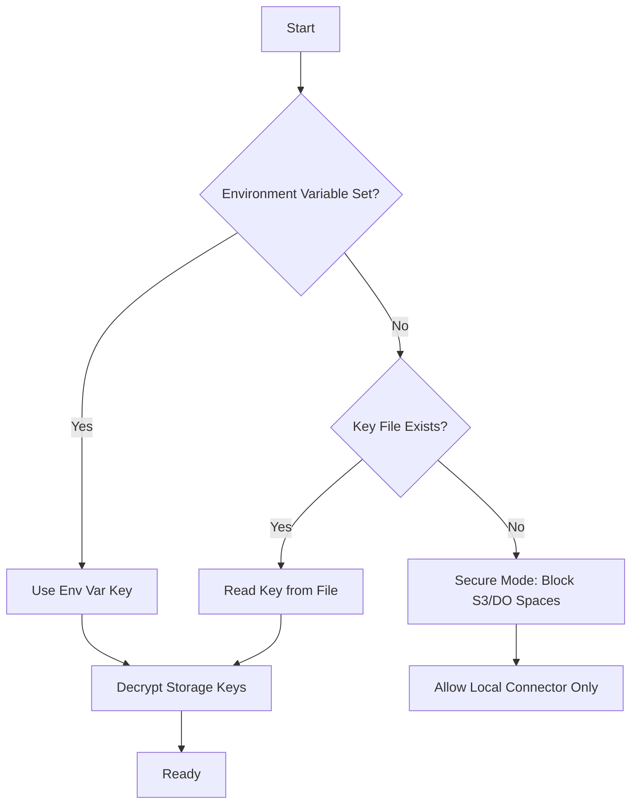

# Plan: Secure Storage Connector API Keys

## Current Situation Analysis

### How API Keys Are Currently Stored

The storage connector API keys are currently stored in **plaintext** in the SQLite database:

1. **Database Table**: `storage_connectors`
2. **Storage Location**: `config` column (JSON format)
3. **Key Fields**: 
   - `key` - The access key
   - `secret` - The secret key

### Code Flow

1. **Bootstrap** ([`src/bootstrap.php`](src/bootstrap.php:232-240)): Loads connectors from database
2. **StorageFactory** ([`src/Phuppi/Storage/StorageFactory.php`](src/Phuppi/Storage/StorageFactory.php:67-74)): Creates S3Storage with config
3. **S3Storage** ([`src/Phuppi/Storage/S3Storage.php`](src/Phuppi/Storage/S3Storage.php:58-68)): Passes keys to AWS SDK

### Security Risk

Anyone with database access can read the plaintext API keys. If the database file is compromised or a SQL injection vulnerability exists, the attacker gains full access to the S3/DO Spaces storage.

---

## Security Approach

### Key Resolution Order

The system will look for the master key in this priority order:

1. **Environment Variable** (`PHUPPI_STORAGE_KEY_MASTER_KEY`) - Production recommended
2. **Generated Key File** (`data/storage-key.key`) - Auto-generated if env var not set
3. **No Key Available** - Block S3/DO Spaces connectors, only allow local storage

### Master Key Resolution Logic



### Connector Behavior

- **Local Storage**: Always available (no API keys needed)
- **S3/DO Spaces**: Only available when master key is configured
  - If master key not available, connectors exist but cannot be activated
  - Attempting to activate will show error message directing user to set up secure key storage

---

## Implementation Tasks

### Phase 1: Master Key Management

1. **Create EncryptionHelper** ([`src/Phuppi/Helper/EncryptionHelper.php`](src/Phuppi/Helper/EncryptionHelper.php))
   - `generateMasterKey()`: Generate cryptographically secure 256-bit key
   - `getMasterKey()`: Resolve key from env var or key file
   - `saveKeyToFile()`: Save generated key to data directory
   - `encrypt()`: AES-256-GCM encryption
   - `decrypt()`: AES-256-GCM decryption
   - `isSecureModeAvailable()`: Check if S3/DO Spaces can be used

2. **Update Bootstrap** ([`src/bootstrap.php`](src/bootstrap.php))
   - Initialize EncryptionHelper early in bootstrap
   - Check for master key availability
   - Log warning if S3/DO Spaces configured but no secure key available
   - Block S3/DO Spaces connector activation if no key available

### Phase 2: Encrypt Existing Keys

3. **Create Database Migration** ([`src/migrations/010_encrypt_storage_keys.php`](src/migrations/010_encrypt_storage_keys.php))
   - Check if master key is available
   - Encrypt existing `key` and `secret` fields in storage_connectors table
   - Add flag to indicate keys are encrypted
   - Handle rollback scenario

4. **Update Storage Loading** (in [`src/bootstrap.php`](src/bootstrap.php) or new method)
   - When loading connectors from DB, decrypt key/secret if encrypted
   - If master key not available and keys are encrypted, log error

### Phase 3: Key Generation Wizard

5. **Add Settings Endpoint** ([`src/Phuppi/Controllers/SettingsController.php`](src/Phuppi/Controllers/SettingsController.php))
   - `generateKey()` action: Generate new master key
   - `getKeyStatus()` action: Check if key is configured
   - Return the generated key (one-time display) for user to copy to env var
   - Save to file if requested

6. **Create Settings UI** (new section in [`src/views/settings.latte`](src/views/settings.latte))
   - Display key status (configured/not configured)
   - "Generate New Key" button
   - Show generated key with copy button (one-time display)
   - Instructions for setting environment variable
   - Warning if S3/DO Spaces connectors exist but secure mode not enabled

### Phase 4: Encrypt New/Updated Keys

7. **Update SettingsController** ([`src/Phuppi/Controllers/SettingsController.php`](src/Phuppi/Controllers/SettingsController.php))
   - In `addConnector()`: Encrypt keys before saving if secure mode available
   - In `updateConnector()`: Encrypt keys when updating if secure mode available
   - If secure mode not available, warn user about plaintext storage

8. **Update S3Storage** ([`src/Phuppi/Storage/S3Storage.php`](src/Phuppi/Storage/S3Storage.php))
   - Add logic to resolve keys from env vars if `key_env`/`secret_env` fields exist (future enhancement)

### Phase 5: Documentation

9. **Create Documentation** ([`public/docs/secure-storage-keys.md`](public/docs/secure-storage-keys.md))
   - Explain why secure key storage is needed
   - Step-by-step setup guide
   - Key generation wizard usage
   - Environment variable configuration
   - Troubleshooting common issues

---

## Files to Create

| File | Purpose |
|------|---------|
| [`src/Phuppi/Helper/EncryptionHelper.php`](src/Phuppi/Helper/EncryptionHelper.php) | Master key generation and encryption utilities |
| [`src/migrations/010_encrypt_storage_keys.php`](src/migrations/010_encrypt_storage_keys.php) | Migration to encrypt existing keys |
| [`public/docs/secure-storage-keys.md`](public/docs/secure-storage-keys.md) | User documentation |

## Files to Modify

| File | Changes |
|------|---------|
| [`src/bootstrap.php`](src/bootstrap.php) | Initialize EncryptionHelper, check key availability |
| [`src/Phuppi/Controllers/SettingsController.php`](src/Phuppi/Controllers/SettingsController.php) | Add key generation endpoints |
| [`src/views/settings.latte`](src/views/settings.latte) | Add UI for key management |

---

## Environment Variables

```bash
# Master key for encrypting storage connector API keys
# Recommended: Generate using the wizard in settings, then copy here
PHUPPI_STORAGE_KEY_MASTER_KEY=your-generated-256-bit-key-here
```

---

## Generated Key File

Location: `data/storage-key.key`

Only created if:
- Environment variable not set
- User requests key generation via wizard

File permissions: Read-only for web server user (0600)

---

## Security Considerations

1. **Key Display**: Generated key shown only once, must be copied immediately
2. **Key Storage**: Env var preferred over file (file may be less secure)
3. **Key Rotation**: Support regenerating key (will invalidate existing encrypted storage keys)
4. **Fallback**: Local storage always works, even without secure mode
5. **Audit Log**: Log when S3/DO Spaces blocked due to missing secure key

---

## User Experience

### Fresh Installation
1. User can set up local storage connector immediately
2. When adding S3/DO Spaces connector, prompted to set up secure key storage first
3. Key generation wizard guides user through setup
4. After key configured, can add S3/DO Spaces connectors

### Existing Installation
1. On first run after update, existing plaintext keys still work
2. Migration runs to encrypt keys (if master key available)
3. If no master key, warning shown in settings
4. User generates key and keys are encrypted
