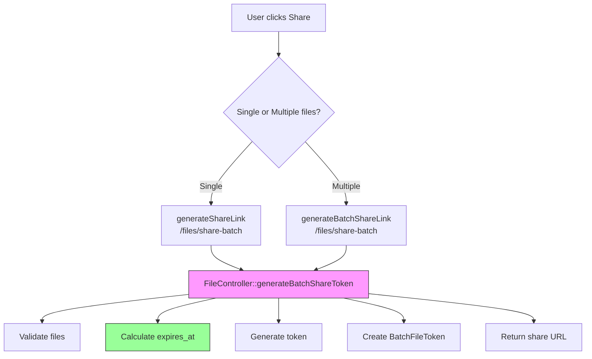

# Single File Share Refactor Plan

## Objective
Improve the file share functionality when sharing a single file by reusing the existing "batch share" methodology, and remove redundant unused code from the former implementation.

## Current State Analysis

### Backend (FileController.php)

Two separate methods handle file sharing:

1. **`generateShareToken($id)`** (lines 958-1024)
   - Uses `UploadedFileToken` model
   - Creates share URL: `/files/{id}?token={token}`
   - ~67 lines of code

2. **`generateBatchShareToken()`** (lines 1031-1100)
   - Uses `BatchFileToken` model
   - Creates share URL: `/files/batch/{token}`
   - ~70 lines of code

### Redundant Code
Both methods contain identical:
- Duration calculation switch statement (lines 974-1005 in generateShareToken, lines 1042-1073 in generateBatchShareToken)
- Token generation: `bin2hex(random_bytes(32))`
- Voucher handling
- Token saving and URL generation

### Frontend (filelist.latte)

- **Single file share** (line 414-433): Calls `/files/${id}/share`
- **Batch share** (line 480-499): Calls `/files/share-batch`

## Implementation Plan

### Step 1: Extract Shared Logic
Create a private helper method to handle the shared duration calculation:

```php
private function calculateExpiresAt(string $duration): ?string
```

### Step 2: Refactor generateShareToken()
Modify to use `BatchFileToken` internally:
- Accept the file ID
- Call `generateBatchShareToken()` with `[file_id]` as the IDs array
- This reuses all existing batch share logic

### Step 3: Update Frontend
Change single file share to use batch share endpoint:
- Modify `generateShareLink()` in filelist.latte
- Call `/files/share-batch` with single file ID array

### Step 4: Remove Redundant Code
- Delete the duration calculation switch statement from `generateShareToken()`
- Keep only the file validation and delegation to batch method

### Step 5: Mark Deprecated (Optional)
- Add deprecation notice to `UploadedFileToken` class
- Keep the class for backward compatibility with existing tokens in the database

## Benefits

1. **Reduced Code Complexity**: Eliminates duplicate duration calculation (~30 lines)
2. **Single Source of Truth**: All share token generation uses one code path
3. **Easier Maintenance**: Bug fixes only need to be applied in one place
4. **Consistency**: Single and batch file sharing behave identically

## Backward Compatibility

- Existing `UploadedFileToken` tokens in the database continue to work
- Routes in `routes.php` check both token types (already implemented)
- No breaking changes to the API contract

## Mermaid Diagram



## Files to Modify

1. `src/Phuppi/Controllers/FileController.php`
   - Add `calculateExpiresAt()` helper method
   - Refactor `generateShareToken()` to use batch method
   - Remove duplicate code

2. `src/views/filelist.latte`
   - Update `generateShareLink()` to use batch endpoint

3. `src/Phuppi/UploadedFileToken.php` (optional)
   - Add deprecation notice in docblock
