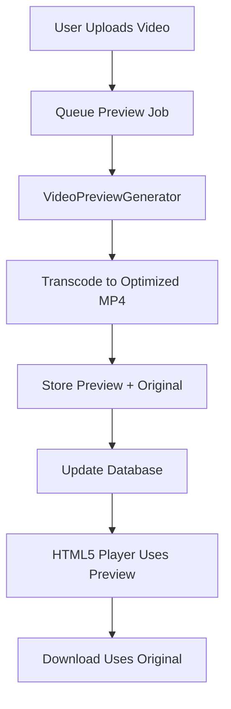

# Video Preview Transcoding Plan

## Overview
This plan outlines the implementation of browser-friendly preview videos for ALL uploaded video formats. Every video will be transcoded to a preview-quality MP4 with faststart optimization, while the original file remains untouched for archival/download purposes.

## Design Decision
**Policy:** All video files shall have a generated preview-quality video file for streaming playback. The original file is preserved intact for sharing and downloading.

## Architecture


## Database Changes
Add new fields to `uploaded_files` table:
- `video_preview_filename` - filename of the transcoded MP4 preview
- `video_preview_status` - status of video preview generation (pending/processing/completed/failed)
- `video_preview_generated_at` - timestamp when preview was generated
- `video_preview_poster_filename` - poster frame for instant display

## Configuration Settings
| Setting | Default | Options | Description |
|---------|---------|---------|-------------|
| video_preview_enabled | 1 | 0/1 | Enable video preview transcoding |
| video_preview_resolution | 720 | 360/480/720/1080 | Maximum height in pixels |
| video_preview_quality | medium | low/medium/high | Quality preset (CRF values) |
| video_preview_audio | 1 | 0/1 | Include audio track |
| video_preview_generate_poster | 1 | 0/1 | Generate poster frame |
| video_preview_queue_mode | cli | cli/ajax | Queue processing mode |

### Quality Presets
| Preset | CRF | Bitrate | Use Case |
|--------|-----|---------|----------|
| low | 28 | 1M | Fast processing, small files |
| medium | 23 | 2M | Balanced quality/size |
| high | 18 | 4M | High quality preview |

## Implementation Steps

### Step 1: Database Migration
- Create migration `006_add_video_preview_fields.php`
- Add columns for video preview metadata
- Add video preview configuration settings

### Step 2: VideoFormatDetector
- Create `src/Phuppi/VideoFormatDetector.php`
- Detect video format and codec
- Determine if video needs transcoding (always true in this design)
- Extract video metadata using FFprobe

### Step 3: VideoPreviewGenerator Service
- Create `src/Phuppi/Service/VideoPreviewGenerator.php`
- Transcode any video format to MP4 H.264/AAC
- Apply faststart flag for progressive playback
- Generate optional poster frame
- Configurable resolution and quality settings

### Step 4: Update PreviewGenerator
- Modify `generateVideoPreview()` to call VideoPreviewGenerator
- Separate thumbnail extraction from video transcoding
- Update status tracking for video preview

### Step 5: Update UploadedFile Model
- Add properties for video preview fields
- Update `load()`, `save()` methods
- Add helper methods for video preview access

### Step 6: Update FileController
- Modify `getPreview()` to serve video previews
- Add new route for video preview poster images
- Update `streamInline()` to use video preview for all videos
- Update `getFile()` to serve original for download

### Step 7: Update Routes
- Add route for video preview: `/files/video-preview/@id`
- Add route for video poster: `/files/video-poster/@id`

### Step 8: Update QueueManager
- Add method to create video preview jobs
- Integrate with existing preview job processing
- Support both CLI and AJAX queue modes

### Step 9: Admin Settings
- Add video preview section in admin panel:
  - Enable/disable toggle
  - Resolution dropdown (360p/480p/720p/1080p)
  - Quality dropdown (low/medium/high)
  - Generate poster toggle
  - Queue mode toggle
  - "Clear and Requeue All Videos" button

### Step 10: Regenerate Script
- Update `bin/regenerate-previews.php` to include video previews
- Add option to regenerate only video previews

### Step 11: Frontend Updates
- Modify video player to use preview MP4
- Add poster attribute for instant display
- Show preview status in file list
- Add "regenerating preview" indicator

## FFmpeg Commands

### Transcode Command
```bash
ffmpeg -hide_banner -loglevel error \
  -i input.{mkv,webm,avi,ts,mpeg,mov,mp4} \
  -c:v libx264 -preset medium -crf {23} \
  -c:a aac -b:a 128k \
  -vf scale=-2:{720} \
  -movflags +faststart \
  -y output.mp4
```

### Poster Extraction
```bash
ffmpeg -hide_banner -loglevel error \
  -i input.mp4 \
  -vframes 1 \
  -vf scale={300}:{300} \
  -q:v 2 \
  -y output.jpg
```

## Files to Create/Modify

### New Files
- `src/migrations/006_add_video_preview_fields.php`
- `src/Phuppi/Service/VideoPreviewGenerator.php`
- `src/Phuppi/VideoFormatDetector.php`

### Modified Files
- `src/Phuppi/Service/PreviewGenerator.php`
- `src/Phuppi/UploadedFile.php`
- `src/Phuppi/Controllers/FileController.php`
- `src/routes.php`
- `src/Phuppi/Queue/QueueManager.php`
- `src/bin/regenerate-previews.php`

## Queue Processing
Video preview generation uses the same queue system as image previews:
- **CLI Mode:** Process jobs sequentially via queue worker
- **AJAX Mode:** Process batch of jobs via browser requests

## Storage Structure
```
uploads/
├── username/
│   ├── original-video.mkv
│   ├── original-video.mp4
│   ├── previews/
│   │   ├── original-video.mp4      # Transcoded preview
│   │   └── original-video.jpg      # Poster frame
```

## Acceptance Criteria
1. User uploads any video format (MP4, MKV, WebM, AVI, TS, MOV, etc.)
2. System queues video preview generation
3. FFmpeg transcodes to optimized MP4 with faststart
4. Preview MP4 is stored alongside original
5. HTML5 video player streams preview with instant playback
6. Download link serves original file
7. Admin can configure resolution and quality
8. Admin can clear and requeue all video previews
9. Works across Chrome, Firefox, Safari, Edge

## Benefits of This Approach
1. **Consistent Experience** - All videos play identically
2. **Original Preserved** - No modification to uploaded files
3. **Faststart Enabled** - All previews support progressive playback
4. **Configurable** - Users can balance quality vs. processing time
5. **Simplified Code** - Single path for all video formats

## Testing Strategy
1. Test with each supported format (MP4, MKV, WebM, AVI, TS, MOV)
2. Test all quality presets (low/medium/high)
3. Test all resolutions (360p, 480p, 720p, 1080p)
4. Verify faststart works (can seek before full download)
5. Cross-browser compatibility testing
6. Large file handling (2GB+ videos)
7. Queue processing under load